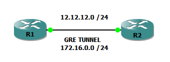
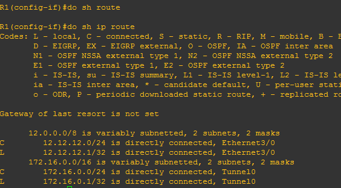
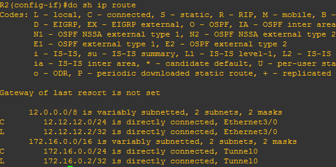
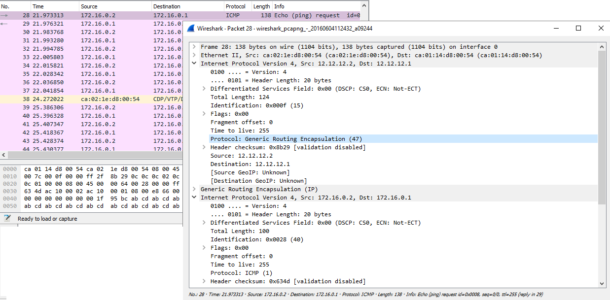

All cadets salute the GRE tunnels! :D

Today we will talk a little about GRE tunnels, a very useful protocol that can help you a lot. As you may now, its present in CCNP R&S blueprint and CCNA v2/v3 as well blueprint _(check **[here](https://recurseit.wordpress.com/2016/05/28/ccna-refresh/)** for more information about [V2](https://learningnetwork.cisco.com/community/certifications/ccna/ccna_exam_v2/exam-topics) to [v3](https://learningnetwork.cisco.com/community/certifications/ccna/ccna-exam/exam-topics) changes)_. But, what are the GRE tunnels? how can we use them? why is the sky blue? did you know that the otters sleep hugging between them? (Otterly lovely!)

We will find the answers to those questions here! :D (I also want to know why the sky is blue)

**What are the GRE tunnels?** _(You! back there! Excellent question! 5 points for gryffindor!)_

First of all, what does GRE means? well, it stands for Generic Routing Encapsulation. Its a tunneling protocol developed by Cisco _(oh yeah! no sharing)_ that can encapsulate a wide variety of protocols inside an IP packet over virtual interfaces. Oh boy that sounds quite interesting! So, we can encapsulate a lot of protocols with GRE and send them through virtual interfaces, which are called tunnels. How can this happen? Well, GRE encapsulate your original packet (lets call it payload) INSIDE a GRE packet, and that GRE packet can be encapsulated into another protocols and then forwared. When the packet arrives the other end of the tunnel, the router rips off the external ip packet, which contains the GRE overhead, and delivers the original packet to its destination. Its like sending a **[matryoshka](https://en.wikipedia.org/wiki/Matryoshka_doll)**! _(you know you want to click that link)_

Now that we have our firsts answers, come at least two more questions on the top of my head: how can we use them? what are the advantages? what kind of problem solve these not-for-share tunnels? _(it later became an industry standard)_

Really the otters sleep hugging between them? _(I couldn't resist it)_

 

**How can we use them?**

Well... GRE  allows Routing of IP packets between private IPv4 networks which are separated over public IPv4 internet. It allows, in fact, almost any protocol payload (like a Swiss knife protocol).

 

**What are the advantages?**

It supports encapsulating IPv4 broadcast and multicast traffic. (Isn't that AWESOME?).

Thats a huge advantage over a normal IPSec tunnel, which just supports unicast traffic.

 

**What are the disadvantages?**

GRE tunnels are not secure because GRE by itself does not encrypt its data payload :(

**BUT**, it can be used together with IPSec to provide network security. You can encrypt your GRE tunnel with IPSec! :D

 

**TIME FOR A QUICK LAB! (OH YEAH!)**

I made a quick lab to show you the simple configuration you need to do to get a GRE tunnel working! :D

First of all: we will need a couple of routers, some cool music, coffee, and snacks! :D

**This is the topology**

****

**And this is the simple configuration you need to get it working**

!R1's Configuration---------------------

interface Tunnel0 ip address 172.16.0.1 255.255.255.0 tunnel source Ethernet3/0 tunnel destination 12.12.12.2

interface Ethernet3/0 ip address 12.12.12.1 255.255.255.0

!R2's configuration----------------------

interface Tunnel0 ip address 172.16.0.2 255.255.255.0 tunnel source Ethernet3/0 tunnel destination 12.12.12.1

interface Ethernet3/0 ip address 12.12.12.2 255.255.255.0

As simple as configure source and destination of our tunnel. You can specify a source up address or interface of your router.

After this Copy-paste festival, we will get something like this:

As you could see, we have in our RIB routes to directly connected interfaces and to the tunnel interfaces. Why do we use an address in the tunnels? Well, we are encapsulatin our GRE packet into an IP packet! :D Its like a digital matryoshka!  (the link is at the top)

**Now, to check the encapsulation, check her this out!**

Thats a ping made from R2 to R1 from between tunnel addresses. In the capture we can see as IPv4 (our public addresses) get encapsulated into GRE, and then, GRE gets encapsulated into IPv4 again (our private addresses into the tunnel). Come on! Don't you think that this is so COOL? Our matryoshka has born! :D

NOTE: You must have considerations with GRE. Your MTU must be reduced in your interface in order to avoid problems overpassing the 1500 bytes standard valor. Its recommended that you put also a couple of commands on your tunnel interfaces, as a good practice. Since GRE is an encapsulating protocol, we adjust the MTU to 1400 bytes and maximum segment size (mss) to 1360 bytes. Because most transport MTUs are 1500 bytes and we have an added overhead because of GRE, we must reduce the MTU to account for the extra overhead. A setting of 1400 is a common practice and will ensure unnecessary packet fragmentation is kept to a minimum.

**Commands: (configured in interface sub-mode, in the tunnel interface)**

R2(config-if)# ip mtu 1400

R2(config-if)# ip tcp adjust-mss 1360

 

Give it a try and tell me how it goes! :D

Next post will include GRE and some other cool thing bundled together.

This has been an interesting post and networking world is HUGE! This journey is just getting started!

 

Stay tuned! :D

PS: Check [here](http://www.dailymail.co.uk/news/article-2421731/Otterly-adorable-Dozy-otters-hold-hands-taking-nap-dont-drift-apart-sleep.html) to know the answer about the otters and [here](http://math.ucr.edu/home/baez/physics/General/BlueSky/blue_sky.html) about the sky and its color.

See that? not just networking! :D
