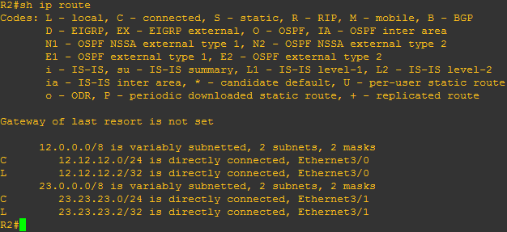

As every movie saga, like Terminator, Star Wars, The Naked gun, Shrek or Resident Evil _(loved that one)_, GRE tunnels are going to have an interesting and cinematographic role here at our blog. Maybe not re-killing zombies _(yes, killing them again!)_ or saving a princes making the dragon eat a dwarf king _(that escalated quicky)_, but with several post about it. Part of this was a recommendation from my dear friend Micheline Murphy (**[@MichyfishMurphy](https://twitter.com/MichyfishMurphy?lang=cs)**), she is a dedicated student and also a wonderful person _(follow her, i command you!)_. You can be relaxed, **no one** is losing a hand in this saga (**i did!** _Shh, Luke! no one is talking about you!)._

In the beginning of the GRE saga we made a simple lab with two routers and a tunnel between them. Kinda easy, huh? This time, we are going to make something more interesting. Not the same as destroying the death star, but we will learn something cool! :D

After this introduction _(where are my drums in the background?)_ then we should head to the topics. First of all: did you know that exist the **[Put A Pillow On Your Fridge Day?](http://www.thefactsite.com/2013/02/put-pillow-on-your-fridge-day.html)** Its on May 29. Make space in your fridge for your pillow! (i could not resist it lol)

Now, let's focus!

## **The facts**

GRE tunnels are designed to be stateless :( that means that one end of the tunnel does not have idea if the other end is reachable! Its routing in the dark! D: That's the reason behind the fact that if you have a tunnel interface, but not a route to the other tunnel endpoint, the tunnel will not come up. We will make an example about it! :) **[Last time](https://recurseit.wordpress.com/2016/06/04/gre-tunnels/)** was easier because we just had two directly connected routers, but in real world we will not have directly connected client's router, right? ;)

So, what happens when we have something in the middle? Normally, a tunnel interface goes up as soon as you have a route to it. But, what if the destination is not reachable? what if a link goes down? As GRE are stateless, guess what? Your traffic is going to be blackholed. BUT, we can also make that connection reliable!

We can implement a feature called GRE Keepalives. Let's read a quote from Cisco's documentation to find out what we can do (don't be worried, then we can translate it for humans).

> The GRE tunnel keepalive mechanism is similar to PPP keepalives in that it gives the ability for one side to originate and receive keepalive packets to and from a remote router even if the remote router does not support GRE keepalives. Since GRE is a packet tunneling mechanism for tunneling IP inside IP, a GRE IP tunnel packet can be built inside another GRE IP tunnel packet. For GRE keepalives, the sender prebuilds the keepalive response packet inside the original keepalive request packet so that the remote end only needs to do standard GRE decapsulation of the outer GRE IP header and then revert the inner IP GRE packet to the sender.

Now, for humans: imagine you are playing **[hot potato](https://en.wikipedia.org/wiki/Hot_potato_(game))** with someone, but you are not using a potato, its a **[matryoska](https://en.wikipedia.org/wiki/Matryoshka_doll).** So, when you open it, there is a another matryoska with a sticked and shinning **[post-it](http://www.post-it.com/3M/en_US/post-it/?WT.mc_id=www.post-it.com)** **_(those fluorescent green ones that literally glow in darkness and burn your pupils when you see them)_** with a message that says: "Let me know when you receive this". Well, more or less _(kinda complicated example, huh?)_. You just have to inform the other tunnel endpoint that the packet was received. Why would you need this?

_(You! The nerd guy in the corner! Tell us!)_

Yes sir! Because we can test reachability! :D

So, in few words, if we don't receive an answer from the other side, then we can assume there is not reachability and our traffic is going to be lost. So, the tunnel interface can **shut itself down** _(yes, dynamically)_ if there is not answer! Isn't that cool? The router will do it by itself! _(Oh dear! Our baby is growing up! A post ago we were just teaching it about a tunnel! :') )_

## **Let's take a look to it in a lab!**

This will be our topology

And, our configurations, at least for a start:

**R1:**

interface Ethernet3/0 ip address 12.12.12.1 255.255.255.0

interface Tunnel0 ip address 172.16.0.1 255.255.255.0 ip mtu 1400 ip tcp adjust-mss 1360 tunnel source Ethernet3/0 tunnel destination 23.23.23.3

**R2:**

interface Ethernet3/0 ip address 12.12.12.2 255.255.255.0 interface Ethernet3/1 ip address 23.23.23.2 255.255.255.0

**R3:**

interface Ethernet3/1 ip address 23.23.23.3 255.255.255.0

interface Tunnel0 ip address 172.16.0.3 255.255.255.0 ip mtu 1400 ip tcp adjust-mss 1360 tunnel source Ethernet3/1 tunnel destination 12.12.12.1

Lets take a look at their routing tables:

Now, we want to establish a tunnel between R1 and R3, and we have configured virtual tunnel interfaces in both sides! So, lets make a ping From R1 to see what happens:

BUT, why? :(

Let's check the tunnels! Something is happening here!

See that? As we don't have a route in any route pointing to the other end of the tunnel, it will not come up. How can we make it work? With networking duct tape! _(yes, static routes)_.

And puff! Having a static route in our configuration brings our tunnels up! :D

Our new routing tables!

Now that our tunnels are up, we can configure keepalives! why? Well, the sad story is that those tunnels are up because of the static route, but it doesn't guarantee that the other end of the tunnel will be reachable. We need a keepalive to check if your friend in the other side is there.

The syntax of this command is pretty easy, and its applied on the tunnel interface:

> Keepalive \[Seconds\] \[Retries\]
> 
> _The default values are 10 seconds for the interval and 3 retries._

So, what will happen here? Keepalives are being sent every \[seconds\] and after some number of \[retries\] without answer, the interface will turn itself down.

When i receive the first keepalive, i start to count. At 10 seconds (by default) i am expecting the next one. If i don't receive it, i will start to count another ten seconds, but i have one retry accounted. So, if on the next opportunity i don't receive the packet, then i have two, and so on...

After 40 seconds, which is the same as 1 try and 3 retries, without answer, the router will shut the interface down.

If the router receives one keepalive before the expiration time, it will reset the counters! Everything will be on zero again and it will start to count from the beginning.

> keepalive 5  3

After adding this commands to our tunnels, i created an ACL in R2 and applied it inbound on the interface Ethernet 3/1 _(to torture R3 and R1)_. As the routers could not reach the other end of the tunnel, after trying and retrying, the tunnel must go down.

> R2#show ip access-lists 100 Extended IP access list 100 10 deny gre any any (56 matches) 20 permit ip any any

Here in this screenshot you can appreciate the debug of the keepalives. Before and after the access list were applied in the interface of R2.

We have R3 (up), R1 (bottom) and R2 (right). First, both routers were receiving the keepalives and the tunnels were up. But, what happened when the ACL was applied in R2?

After one try and 3 retries of sending a keepalive and not receiving a response (see R3), it shut the interface down by itself.

See that? they went down!

Lets bring them back up! Well, something better! Lets remove the ACL on R2 and watch how they revive from their ashes! :D

After the first keepalive received again, intermediately the tunnel is brought back up by R1 and R3! Isn't that cool? :D

As we could demonstrate, keepalives work, and very well!

 

 

Lab it up and tell me how it goes!

I hope you have enjoyed and learned a lot, like me doing this lab.

 

More of GRE coming on its way! Wait for it!

The Saga continues!
