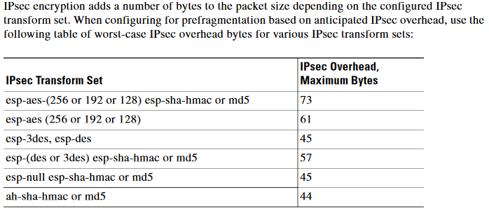

Heeey! :D Here we are again _(sorry for the delay in this post, been quite busy lately)_, this time we will talk about security _(a little bit)_ on GRE tunnels.

As we talked previously _(see previous chapters of the GRE Saga)_, we can establish a tunnel between two peers, over the public internet, right? **[_(chapter 1)_](https://recurseit.wordpress.com/2016/06/04/gre-tunnels/)**. Then, we saw that GRE is stateless, so, we cannot determine if the other side of the tunnel is reachable or not. We must have a route in order to bring up the tunnel interface (which is logical), but we don't know about the other end. That changed a bit when we discovered that we could implement keepalives **[_(chapter 2)_](https://recurseit.wordpress.com/2016/06/16/gre-tunnels-ii-revenge-of-keepalives/)**, which is like having an annoying friend asking you every "n" seconds something like: "Dude, Are you there?"

Now, we also learned that GRE tunnels can help you to carry other protocols and they are sent as unicast packets _(single sender and single receiver)_, BUT, they have a terrible weakness _(like Superman's)_... They are NOT secure :(

There is something really cool called **[IPSec](https://en.wikipedia.org/wiki/IPsec) _(we can make a post about it later)_** which is a protocol that allows us to secure our communications by encrypting and authenticating each IP packet per session _(feel like ninja)_. I agree, IPSec is very handy, BUT, if you establish an IPSec tunnel between two peers, it only supports unicast traffic :( So, broadcast and multicast are out of the equation, which means that we cannot implement routing protocols that rely on multicast, for example.

So, we have GRE in one side, which carries any other protocols but it's not secure, AND, we have IPSec, which is secure, but only can carry unicast traffic. Are you thinking the same i am? _(because i was thinking in Chinese food!)_ YES! What about ENCRYPTING a GRE tunnel with IPSec? YEAH! That's BRILLIANT! _(that nerd guy in the corner knows everything!)_

Our result will be the following: We will encapsulate our packets in a GRE packet, right? then, that GRE packet will be encapsulated into an IP packet... AND, guess what? we encrypt THAT IP packet and its sent as unicast through an IPSec tunnel. Isn't that cool? We have this unbeatable networking ninja **[matryoshka](https://en.wikipedia.org/wiki/Matryoshka_doll)** that protects our packets when they travel through public internet.

I am sure there is some people thinking about encapsulation, and that is a special detail that needs to be considered. In order to encapsulate our packets in GRE, router needs to add an overhead (24 bytes) to inform the other router about whats is carrying. Now, we need to encapsulate it IN IPSec, so, that adds a little more overhead.

This is a table from Cisco identifying bytes needed:

So, what does it tell you? that WE NEED/MUST _(if you want it to work properly)_ change the MTU (1500 bytes by default) to allow this encryption process to run without affecting our traffic forwarding.

Also, we have this little table from Cisco about IPSec and GRE together:

PS: IPSec transform Set is a combination of individuals IPSec transforms designed to enact an specific security policy for traffic flow. In transport mode the original IP packet is not encrypted, only the payload _**(we need a post only for IPSec for sure!).**_

NOW, how about doing a quick lab to check our theory? :D

Remember the lab from **[chapter 1](https://recurseit.wordpress.com/2016/06/04/gre-tunnels/)? We will apply IPSec to our tunnels**

I created a couple of loopback interfaces to simulate a connected network. The idea is to make our traffic being encrypted and encrypted and then reaching the loopback interfaces. Simulating a branch office or something like that :)

Initial configurations:

> R1-----------------------------------
> 
> interface Tunnel0 ip address 172.16.0.1 255.255.255.0 ip mtu 1400 tunnel source Ethernet3/0 tunnel destination 12.12.12.2
> 
> interface Ethernet3/0 ip address 12.12.12.1 255.255.255.0
> 
> interface Loopback0 ip address 10.10.1.1 255.255.255.0
> 
> R2-----------------------------------
> 
> interface Tunnel0 ip address 172.16.0.2 255.255.255.0 ip mtu 1400 tunnel source Ethernet3/0 tunnel destination 12.12.12.1
> 
> interface Ethernet3/0 ip address 12.12.12.2 255.255.255.0
> 
> interface Loopback0 ip address 10.10.2.1 255.255.255.0

Now, we need to add static routes to routers to be able to reach loopback interfaces.

On R1:

> ip route 10.10.2.0 255.255.255.0 172.16.0.0

On R2:

> ip route 10.10.1.0 255.255.255.0 172.16.0.0

Now we make pings to check connectivity:

> R1#ping 10.10.2.1
> 
> Type escape sequence to abort. Sending 5, 100-byte ICMP Echos to 10.10.2.1, timeout is 2 seconds: !!!!! Success rate is 100 percent (5/5), round-trip min/avg/max = 4/31/64 ms

> R2#ping 10.10.1.1
> 
> Type escape sequence to abort. Sending 5, 100-byte ICMP Echos to 10.10.1.1, timeout is 2 seconds: !!!!! Success rate is 100 percent (5/5), round-trip min/avg/max = 4/20/60 ms

Woohooo! :D Everything working so far, BUT, NOT SECURE! Lets implement the IPSec encryption!

**We need to create an access list to match the traffic that is going to be encrypted**

Piece of cake! We need to match the **OUTSIDE** interface of routers in the access lists.

On R1:

> access-list 101 permit gre host 12.12.12.1 host 12.12.12.2

On R2:

> access-list 101 permit gre host 12.12.12.2 host 12.12.12.1

Configure an isakmp policy (set of rules and configurations that **must match in both sides**)

> crypto isakmp policy 1 authentication pre-share

Here we are telling routers to match a pre-shared key for authentication (remember that IPSec authenticates and encrypts)

**Now we create the pre-shared key that routers will use and the peer to send that key:**

On R1

> crypto isakmp key secured-potato address 12.12.12.2

On R2

> crypto isakmp key secured-potato address 12.12.12.1

See the syntax! crypto isakmp key \[pre-shared key\] address \[peer address\]

Now the transform set used by both routers, must match both sides. **_(we will talk in deep later about this)_**

> crypto ipsec transform-set potato esp-3des esp-md5-hmac

On this transform set we choose what we will use to encrypt and a tag to identify it _(potato is the tag)_

This is our full configuration, up to this point:

> R1--------------------------------------------------
> 
> crypto isakmp policy 1 authentication pre-share crypto isakmp key secured-potato address 12.12.12.2 crypto ipsec transform-set potato esp-3des esp-md5-hmac
> 
> R2----------------------------------------------------
> 
> crypto isakmp policy 1 authentication pre-share crypto isakmp key secured-potato address 12.12.12.1 crypto ipsec transform-set potato esp-3des esp-md5-hmac

Guess what? now that we have a peer, a pre-shared key, an ACL that must match out traffic to be encrypted, a transform set and a tag... We need to put everything together!

So, we need to create a crypto map! Its like a giant security blender :D

> R1-------------------------------------
> 
> crypto map NINJA\_POTATO 10 ipsec-isakmp set peer 12.12.12.2 set transform-set potato match address 101
> 
> R2------------------------------------- crypto map NINJA\_POTATO 10 ipsec-isakmp set peer 12.12.12.1 set transform-set potato match address 101

Keep an eye on this process. We are creating a crypto map, and matching everything we configured before to make them work together. Its like networking glue! :D

Check the syntax! Its like a route map, but with security features.

crypto map **\[name\] \[sequence number\]** ipsec-isakmp **(set of rules used)**

Now, people, we need to apply that crypto map to our interfaces. This is the easy part :)

Depending of the ios version, you must apply it in the physical and logical interface as well

> interface Tunnel0 crypto map NINJA\_POTATO
> 
> interface e 3/0 crypto map NINJA\_POTATO

We should receive a message like this:

> %CRYPTO-6-ISAKMP\_ON\_OFF: ISAKMP is ON

Now that everything is in place _(finally!)_ lets test connectivity.

> R1(config)#do ping 10.10.2.1
> 
> Type escape sequence to abort. Sending 5, 100-byte ICMP Echos to 10.10.2.1, timeout is 2 seconds: !!!!! Success rate is 100 percent (5/5), round-trip min/avg/max = 12/16/32 ms
> 
> R2(config)#do ping 10.10.1.1
> 
> Type escape sequence to abort. Sending 5, 100-byte ICMP Echos to 10.10.1.1, timeout is 2 seconds: !!!!! Success rate is 100 percent (5/5), round-trip min/avg/max = 8/19/32 ms

And, also lets check the crypto sessions! :D

> Interface: Tunnel0 Ethernet3/0 Session status: **UP-ACTIVE  <---- (OH YEAH)** Peer: 12.12.12.2 port 500 IKE SA: local 12.12.12.1/500 remote 12.12.12.2/500 Active IPSEC FLOW: permit 47 host 12.12.12.1 host 12.12.12.2 Active SAs: 2, origin: crypto map
> 
> R2(config)#do sh crypto session Crypto session current status
> 
> Interface: Tunnel0 Ethernet3/0 Session status: **UP-ACTIVE   <---- (OH YEAH)** Peer: 12.12.12.1 port 500 IKE SA: local 12.12.12.2/500 remote 12.12.12.1/500 Active IPSEC FLOW: permit 47 host 12.12.12.2 host 12.12.12.1 Active SAs: 2, origin: crypto map

Congratulations! you have implemented your first IPSec encryption over a GRE tunnel! :D

More IPSec in following post!

Thanks for reading
