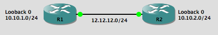

Heeello everyone! Again, sorry for the late post, I am trying to do them more often (_sometimes it's quite challenging)_. GRE Saga is on hold, i am looking for actors and proper scenes to make the history interesting. So, castings are taking place! If you have suggestions about a new topic or whatever you think can help the blog, click **[here](https://www.linkedin.com/in/davidsamuelps/)** and send me a message! :D

Today I will introduce you one of the most basic and filtering techniques that you will ever find out there. You will learn that ACLs are the very foundation of filtering techniques and a huge support for routing protocols and other deep stuff that require selective matching. Simple doesn't mean useless, actually, sometimes the challenge is to do simple things in an excellent and flawless way ;)

Its time to introduce you to the almighty _(Drums in the background)_ Access Control Lists (ACLs)! How do they work? What can you do with them? Well... we will find out! :D

First of all: Everyone call them Access Lists, the "control" keyword gets sucked into the dark hole of laziness we have as engineers. Yes, you have it. If not, find it now! _(You will need it, trust me)_. It must be close to Pizza Galaxy or Burger Nebula _(I couldn't resist it!)._

## The facts

ACLs are like the big security guys with black shirts in the door of your routers. They even have this list with several lines. In ACL's language, this lines are called Access Control Entries (ACEs), and they follow a match/not match logic. Its pretty simple: you specify details, such as source and destination ip address. Then, an action, like permit or deny. Aaaaand, voila! You have a simple access list. That's all! (I told you it was simple!).

**Key fact**: every ACL is evaluated top-down. That means every ACE _(every line)_ is checked until there is a match. When a match is found, **no more entries are evaluated after the match.** With every ACE you enter in an ACL, automatically it gets a sequence number _(every time it sums 10),_ so, keep an eye on that. We will dig into details about this later in this post.

You can create several types of ACLs: Standard, Extended and Named. ACLs are identified by their number. So, depending on the number you give to them when creating, they will be standard or extended. If you check **[here](http://www.ciscopress.com/articles/article.asp?p=1697887)** you will see a short summary from Cisco. Before, many moons ago, when networking was dealing with dinosaurs, you had to put your ACLs in a number range in order to identify them _(that was before IOS 11.2)_. Now you can name them! Which is easier for troubleshooting. For now, we will focus on these two types of ACLs _(using Cisco's table)_:

#### ACL Number Ranges

**Standard ACLs** are quite simple, just an address and a network mask, with the action to follow if it's matched. In the case of **Extended ACLs,** you can get fussy if you want (_wink wink_). You can specify source address, destination address, protocol number, protocol name, service, source and destination port number and logging. Sounds interesting, huh?

Finally, **Named ACLs**, are the best part of the group. You can name them _(quite obvious, huh?)_, which is MUCH MORE easy to find than a numbered ACLs. You can named them in a way that they tell you what are you doing with them. Not just for you, also for other people reading your configuration. Its easier to read "NAT\_ACL" than a number, because then you must find in some place of your documentation, what is that ACL doing. Functionality is almost the same, you can even do some stuff in named ACLs than you can't with numbered/extended ACLs _(like reflexive ACLs - we can talk about it later)_.

You have two ways to configure them:

**Old School way:**

```R1(config)#access-list ?
  <1-99> IP standard access list
  <100-199> IP extended access list
  <1000-1099> IPX SAP access list
  <1100-1199> Extended 48-bit MAC address access list
  <1200-1299> IPX summary address access list
  <1300-1999> IP standard access list (expanded range)
  <200-299> Protocol type-code access list
  <2000-2699> IP extended access list (expanded range)
  <2700-2799> MPLS access list
  <300-399> DECnet access list
  <700-799> 48-bit MAC address access list
  <800-899> IPX standard access list
  <900-999> IPX extended access list
  compiled Enable IP access-list compilation
  dynamic-extended Extend the dynamic ACL absolute timer
  rate-limit Simple rate-limit specific access list
```

Syntax is this one:

```
Router(config)#access-list ACL_Identifier_number permit|deny IP_Address|host|any [log]
```


And, **named mode** (you need to enter first in the ACL configuration mode):

```
Router(config)#ip access-list extended ACL_name_number
Router(config-ext-acl)# permit|deny IP_protocol source_IP_address wildcard_mask [protocol_information] destination_IP_address wildcard_mask [protocol_information] [log]
```

We have talked about what we can match, but, lets talk about practical uses. Why would you use an Standard ACL? They just can filter based on ip address, not detailed as Extended. Well, it depends! If you want to block traffic from a certain host to a server, for whatever the reason, you can use a Standard ACL! :D Aaaand, as we are talking about this, i have just remembered that i haven't told you how to enable them, just creating! _(my bad there!)_

You can enable them when applying to an interface, in that moment you can decide also in which direction you want to filter. Inbound or outbound. Sometimes it's a tricky question, so, an easy way to get the answer is thinking of you as the router. Traffic going in your direction is INBOUND, and traffic going in the opposite direction as where you are, is OUTBOUND. People also say that coming to the router is inbound, and leaving the router is outbound. It works also as a good example.

**You can apply one ACL per protocol, per direction (inbound/outbound), per interface.** 

**Key fact #2:** There is an **implicit deny** at the end of EVERY ACL. Which means you cant see it, but ITS THERE! Whatever you are not permitting in previous ACEs, is going to be denied at the end of the ACL. So, be careful!

**Key fact #3**: Standard ACLs should be placed near destination, because of the limited filtering based on ip address. Extended ACLs should be placed near the source. What could happen if we do not follow this guideline? Well. Think about it. IF you apply a Standard ACL near the source: you may end up blocking traffic you do not need to block. Extended ACL near destination: you are letting traffic move in the network (from source to destination) and it will be blocked anyway when arriving to destination. So, you will lose bandwidth.

A good way to remember the correct implementation is to think this way:

**S**tandard close to destination ------  One "S" (Correct)

Extended close to **S**ource          ------  One "S" (Correct)

**S**tandard close to **S**ource             ------ Two "S" (Incorrect)

Extended close to destination ------ No "S" (Incorrect)

This example can be found **[here](https://learningnetwork.cisco.com/thread/23104)** on Cisco Learning Network, written by Martin.

 

**Now that we have learned a lot of theory, what about a lab? :D**

We will build a simple lab like this one:



So, let imagine we want to block traffic comming from network 10.10.1.0/24 and going to network 10.10.2.0/24. If we dont want to block an specific protocol, then we can use an Standard ACL. Lets do it :D

Remember we must create a static route in order to reach loopbacks

```R1(config)#ip route 10.10.2.0 255.255.255.0 12.12.12.2
 R1(config)#do ping 10.10.2.1  
 Type escape sequence to abort.
 Sending 5, 100-byte ICMP Echos to 10.10.2.1, timeout is 2 seconds:
 !!!!!
 Success rate is 100 percent (5/5), round-trip min/avg/max = 12/38/108 ms
---
R2(config)#ip route 10.10.1.0 255.255.255.0 12.12.12.1
 R2(config)#do ping 10.10.1.1
 Type escape sequence to abort.
 Sending 5, 100-byte ICMP Echos to 10.10.1.1, timeout is 2 seconds:
 !!!!!
 Success rate is 100 percent (5/5), round-trip min/avg/max = 16/27/52 ms
```
Now, as we want to block traffic from 10.10.1.0 network going towards 10.10.2.0 network, and we will use a Standard ACL, we must place the ACL in R2. Remember, Standard ACLs are placed close to destination ;)

So, lets create it!
```R2(config)#access-list 1 deny 10.10.1.0 0.0.0.255
R2(config)#access-list 1 permit any
R2(config)#int fa 0/0 
R2(config-if)#ip access-group 1 inbound <----- Binding ACL and specifying direction
```
Remember that the ACLs have a **implicit DENY in the end**, so, whatever we do not allow to pass, **will be blocked by the implicit DENY**. With this last line, we make sure that the rest of the traffic, except the one we are blocking, will be allowed.

In order to use an ACL, we have to bind it to an interface and specify the direction we want it to filter. We do it with "ip access-group" command.

Now that we have created and placed our ACL, how about a test?

If we try to ping, it will succeed!
```R1#ping 10.10.2.1
 Type escape sequence to abort.
 Sending 5, 100-byte ICMP Echos to 10.10.2.1, timeout is 2 seconds:
 !!!!!
 Success rate is 100 percent (5/5), round-trip min/avg/max = 16/24/40 ms
```
But, why?

The reason is that the router is pinging from the closet interface, which is fa 0/0. And, from that ip address, the traffic is alllowed. But, what about pinging from the loopback which addresses are blocked?

```R1#ping 10.10.2.1 source lo0 <--- source address will be loopback's 
 Type escape sequence to abort.
 Sending 5, 100-byte ICMP Echos to 10.10.2.1, timeout is 2 seconds:
 Packet sent with a source address of 10.10.1.1
 UUUUU
 Success rate is 0 percent (0/5) <------ See that? DENIED!
```

Now, how would be the same access list, but extended?

```
R2(config)#access-list 101 deny icmp 10.10.1.1 0.0.0.255 10.10.2.1 0.0.0.255 echo
R2(config)#access-list 101 permit ip any any
```
and, lets make a quick show:

```R2(config)#do sh ip access
 Standard IP access list 1
  10 deny 10.10.1.0, wildcard bits 0.0.0.255 (30 matches)
  20 permit any (30 matches)
 Extended IP access list 101
  10 deny icmp 10.10.1.0 0.0.0.255 10.10.2.0 0.0.0.255 echo
  20 permit ip any any
```

See the difference? We need to be more specific here, because the level of detail is higher! You will see that you get a lot of details when you type "?" after every word. I will leave that part to you, that way you can make cool experiments :D

Remember when i told you that the ACLs have sequence numbers? There you have them!

Every time you create a new ACE, it will assign it a sequence number 10 units higher than the previous one. WHY? Because an ACE cannot be modified. So, if you need to add something before ACE 20, you must delete the ACL and do it again. It will evaluate them in an incremental order. Remember this ACL was created under the older mode.

But, with named mode ACLs you can! :D

Lets make it again in named mode.

```R2(config)#ip access-list extended POTATO
 R2(config-ext-nacl)#?    <----- See that now we are in a different mode! :o
 Ext Access List configuration commands:
  <1-2147483647> Sequence Number  <---- You can specify the sequence number!
  default Set a command to its defaults
  deny Specify packets to reject
  dynamic Specify a DYNAMIC list of PERMITs or DENYs
  evaluate Evaluate an access list
  exit Exit from access-list configuration mode
  no Negate a command or set its defaults
  permit Specify packets to forward 
  remark Access list entry comment
 R2(config-ext-nacl)#deny gre 10.10.1.1 0.0.0.255 10.10.2.1 0.0.0.255 <--- This is a test to then put the ACE that denies ICMP before it. We are not doing GRE tunnels this time.
 R2(config-ext-nacl)#permit ip any any  <--- Always permit the rest of the traffic!
```
Lets make a show:
```
R2(config-ext-nacl)#do sh ip acces
 Standard IP access list 1
  10 deny 10.10.1.0, wildcard bits 0.0.0.255 (30 matches)
  20 permit any (30 matches)
 Extended IP access list 101
  10 deny icmp 10.10.1.0 0.0.0.255 10.10.2.0 0.0.0.255 echo
  20 permit ip any any
 Extended IP access list POTATO
  10 deny gre 10.10.1.0 0.0.0.255 10.10.2.0 0.0.0.255
  20 permit ip any any
```

How to add something before the ACE with sequence number 20?
```
R2(config-ext-nacl)#**15** deny icmp 10.10.1.1 0.0.0.255 10.10.2.1 0.0.0.255
```
And, now, show again! :D
```
R2(config-ext-nacl)#do sh ip acces 
 Standard IP access list 1
  10 deny 10.10.1.0, wildcard bits 0.0.0.255 (30 matches)
  20 permit any (30 matches)
 Extended IP access list 101
  10 deny icmp 10.10.1.0 0.0.0.255 10.10.2.0 0.0.0.255 echo 
  20 permit ip any any
 Extended IP access list POTATO
  10 deny gre 10.10.1.0 0.0.0.255 10.10.2.0 0.0.0.255
  15 deny icmp 10.10.1.0 0.0.0.255 10.10.2.0 0.0.0.255  <---- OH YEAH! :D
  20 permit ip any any <---- Remember this always when you create an ACL!
```
Now, lets apply it on our interface! We should be blocked when making a ping.
```
R2(config-if)#int fa 0/0 
R2(config-if)#ip access-group POTATO in
```
From R1's perspective:
```
R1#ping 10.10.2.1 source lo0
 Type escape sequence to abort. 
 Sending 5, 100-byte ICMP Echos to 10.10.2.1, timeout is 2 seconds:
 Packet sent with a source address of 10.10.1.1
 UUUUU
 Success rate is 0 percent (0/5)
```
Now, lets see if the ACL is being matched
```
R2(config-if)#do sh ip acces 
 Standard IP access list 1
  10 deny 10.10.1.0, wildcard bits 0.0.0.255 (30 matches)
  20 permit any (30 matches)
 Extended IP access list 101
  10 deny icmp 10.10.1.0 0.0.0.255 10.10.2.0 0.0.0.255 echo
  20 permit ip any any
 Extended IP access list POTATO
  10 deny gre 10.10.1.0 0.0.0.255 10.10.2.0 0.0.0.255
  15 deny icmp 10.10.1.0 0.0.0.255 10.10.2.0 0.0.0.255 (85 matches) <-- A lot of pings there!
  20 permit ip any any
```

See that? We can block whatever we want with ACLs. And this is just the basic stuff! We can get creative :D

NOTE: It was easier to do everything in R2. But, if you have been paying attention, you should have noticed that the ideal point to place the EXTENDED ACL, was on R1's Fa0/0 interface, not R2. Because it should be CLOSE to source (if extended).

I hope you have enjoyed this post as much as i did writing it!

As always, try at home, make some experiments, get creative, and... let me know of you want to share your results, suggest topics for next post, or whatever you think can help here at recurseit :D

See you around!
