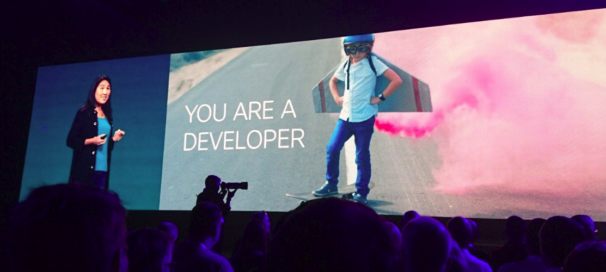
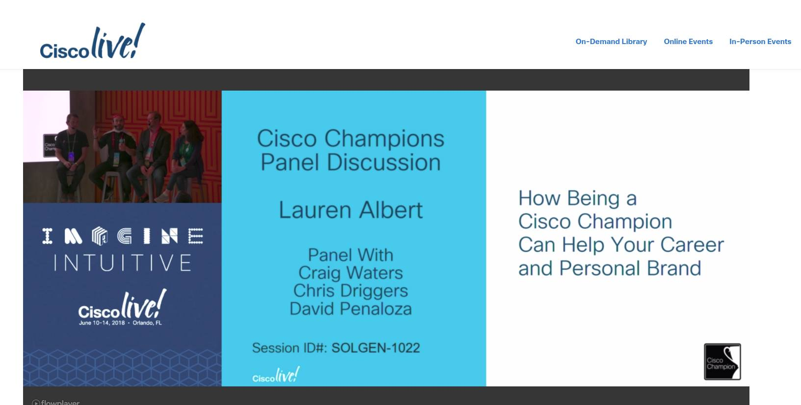
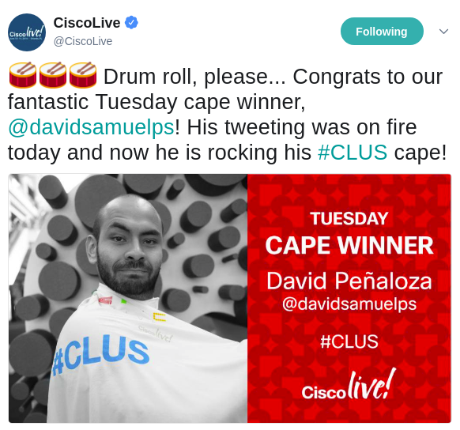
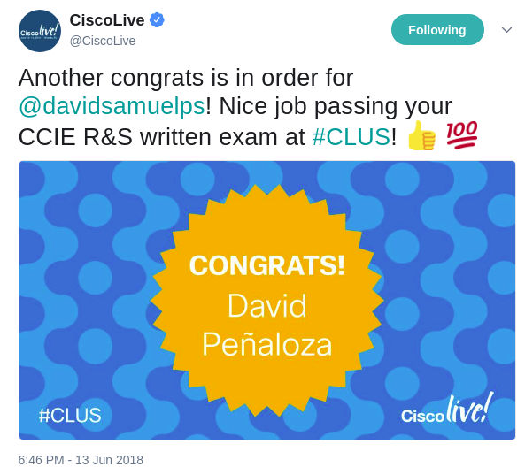
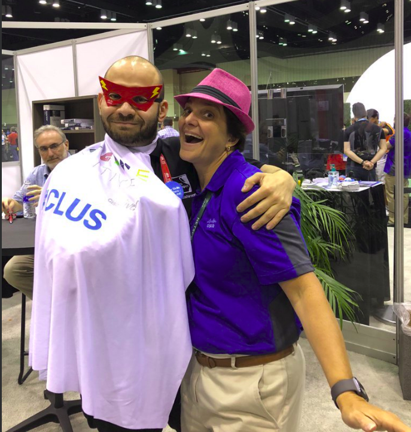
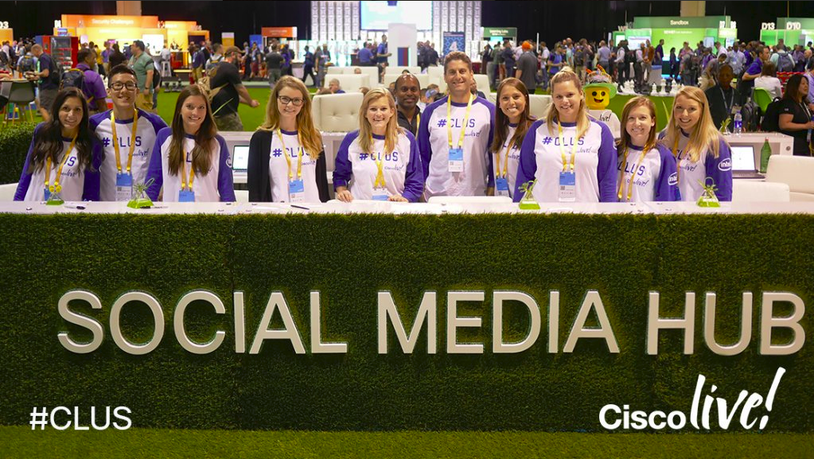
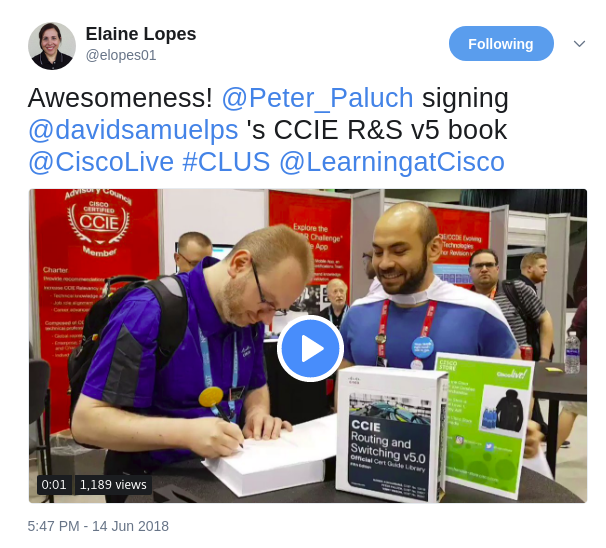

Hello everyone! :D

Here we are again, as i promised in the **[previous post](https://recurseit.wordpress.com/2018/06/17/a-lot-happened-updates-are-in-order/),** we will talk a little about Cisco Live US!

First things first: It was my first CLUS, I've been two times in CLEUR, but never in CLUS or US before. Actually, i had to run the last month with visa and appointments and a lot of paperwork to be there, and it was worth it! :D

I've found a HUGE difference with regards to size and organization between CLUS and CLEUR. Many things that are available in US are not in Europe (like the huge TacOps truck parked in the convention center) and for sure, this is motivated by the amount of people attending. CLEUR had around 7000 attendees and CLUS 27000-28000 (apologies if numbers are not accurate). This doesn't mean that CLEUR is worse or CLUS is better, the public is different (a lot of people only go either to US or Europe) and as it grows, arrangements around it change to accommodate the people and experiences to offer.

I had the opportunity to check amazing sessions, like Troubleshooting EIGRP/OSPF/IS-IS (imparted by Peter Paluch, Nick Russo and Brad Edgeworth) were INSANE, and **i would recommend you to check them** out at Cisco Live's website.

In the keynotes, we had Chuck Robbins telling us that the place to go is simplicity, networks are growing amazingly complex because we are massively connected (say IoT and mobiles devices) and we cannot manage something complex with even more complex processes. So, the call is for simplicity and automation (yeah, dude, start learning python and APIs, it will help). DNA center was heavily mentioned ;)

Could you believe that DevNet reached 500K people registered? Susie gave an inclusive and closer message than other speakers, and let everybody know that all of us, people moving networks forward, learning new stuff and trying to get into the programmability, we are developers. It was a very clever way to invite you there :)

Now, regardless of where networking is heading (or what industry says its heading), this doesnt mean you will not be needed as a network engineer, experts are ALWAYS needed, and doesnt matter if networks would be automated in the future, they will be moving and working by the same principles networks now. Knowledge is and will be needed always, before operating it you need to understand how it works!

The engineer role is not disappearing, and will not disappear anytime soon :) BUT, its wise to learn more about APIs, programmability and complement your toolbox so you can broaden your scope.

Had the opportunity to record a podcast and an interview (will be released soon), be in a contest - Engineer Deathmatch - and a panel (and the panel was recorded - OMG!)

Did you have the chance to go by DevNet zone? They are growing amazingly! Make sure to check them out (im going through some courses for python, not bad!)

Stepping aside from sessions, technical stuff, business announcements and other topics, what I do believe is one of the most important things in the event (whether its Europe or US) is networking, being social!

Meeting people, saying hello and putting voices in faces you see in twitter and documents you have read before. Although we live in an era where WebEx and other tools shorten distances and make collaboration possible, nothing can replace this feeling of human warmth. After all, these events are possible because of the people, or like Cisco used to say: "The human network" - And let me tell you that, even when CLUS was in Orlando (and its HOT and humid), i felt the most of the real warmth inside the convention center :) (yes, it was a pink/human/poetic moment).

Social interaction is heavily integrated in the fibers of the event, and the social media team at CLUS, the facility maintenance team (the people giving you food and cleaning everything) and the support people (the ones dressing in green and always telling you were the rooms were) are not exempt from this. They were an absolute blast! Remember always to smile to them, they will smile back ;)

I had the chance to win a cape on tuesday for my tweets and i was looking fabulous! (told you its important!)

They even congratulated me when i passed an exam <3

Elaine Lopes gave me a superhero mask as a gift, and I had my outfit complete! The next i did was to take a picture with Denise Fishburne <3

Isn't it amazing? :D

I cannot stress enough how amazing was to meet the people, take pictures, talk, have coffee, and do it all over again.

As a last point, the CAE!

We had the chance to enjoy Universal Studios Florida for some hours. IT WAS AMAZING! I was doing lines to take the rides and feeling like a kid!

I dont know how it will be in 2019, but, as this year, i will do my best to be everywhere and squeeze the most of it. Its an unique experience!

Thanks for reading!

Bonus pictures!

CLUS Social Media team

The following are pictures with a lot of fun and love :D

 

\[gallery ids="1294,1295,1296,1297,1298,1299,1300,1301,1302,1303,1291,1290,1287,1286,1285,1279,1280,1281,1282,1283,1284,1278,1277" type="slideshow" link="file" orderby="rand"\]

 

\[gallery ids="1287,1286,1285,1284,1283,1282,1277,1278,1279,1280,1281,1290,1291" type="slideshow" orderby="rand"\]

I had the chance meet Wendell Odom (runs in circles) and Denise Donohue! (she gives amazing hugs!) - Also met a dinosaur, Dmitry Figol, Stuart Clark, Mark Holm, Silvia Spiva, Susie Wee, Elaine Lopes, Nicole Wajer and #PaperPeter! (this is not in order of importance! all of them are :) ) - We had fun on an escalator! (nobody was injured) :D

And, Peter Paluch signed my book! #fangirlmoment (see the cape there?)

