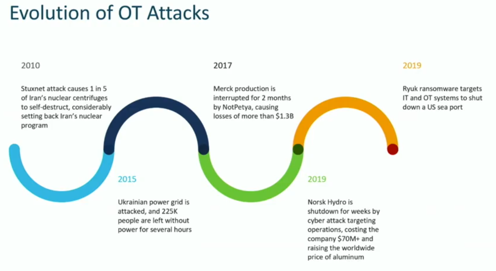

Many of us have heard the term "Internet of Things (IoT)" in this or another way, perhaps an advertisement, overhearing a conversation between geeks from the IT department (if you are not into IT), a discussion with colleagues (if you are a geek yourself), or in the news. What exactly do we mean with IoT?

**Setting the stage:**

IoT is defined by the IEEE as “A network of items — each embedded with sensors —which are connected to the Internet.”\[1\]. This definition is wide but highlights the two essential parts of what we intuitively understand as the "internet of things" - a network of elements capable of gathering inputs from their environment through sensors, and having Internet connectivity. Anything connected to the internet can be an IoT device, in other words: your cellphone, the smart plug you use to turn off and on your IP-enabled coffee machine, the camera you use to check on your backyard through a mobile application, or your fancy new refrigerator with a cool touchscreen and camera inside.

IoT has many positive traits, the most important ones being the simplicity to set devices up and harnessing their capabilities remotely at our disposal - anything is now IP enabled, and you can find all-in-one kits already prepared for you. How is this possible? It relies on commodity hardware and Linux (it's free!) to lower down the price and make it affordable for everybody, hence, increasing its reach to the masses.

**The challenges:**

Not everything is positive, though. Relying on commodity hardware has its downsides: many companies without any networking experience start to roll out devices without considering the security implications. This translates into minimal configurations made by the vendors, leading to poor device hardening, default or hardcoded passwords and common vulnerabilities between many devices.

According to a forecast by Gartner, 20.4 billion connected things will be in use worldwide by 2020 \[2\] - that is a monumental amount of devices. Now imagine **all** those devices connected to the internet with default passwords and no protection in place. It would be an IT version of the SARS-CoV-2, everywhere!

This is not a picture of the whole landscape, though. The lack of security not only affects end customers like you and me, but enterprises and industries as well. Similar to your garage sensor opening your garage door when you arrive home, industries of all sorts make use of devices to detect events and perform actions, like the baggage conveyor belts at the airports detecting the presence of your baggage, weighing it, and helping direct it all the way to the ground staff for further handling. The use of sensors and inter-connected devices with the goal of monitoring and performing tasks in the industry space is called Operational Technology (OT).

The difference, though, is that OT started many years in the past, and is based on other protocols, and certainly, other standards. Security was neither built-in, nor was it a concern. Additionally, OT tends to get outdated. How do you replace a massive metal cutter machine that has been running for decades, just because it needs to become IP enabled or have a newer software version?

Many of those devices are not even IP-enabled. They work with other protocols (like PROFINET) in flat L2 networks. Since their controller requires reachability to the machines and devices is controlling, the easiest way before was to put every one of those devices in a common Layer2 domain. This raises a flag, as no segmentation is implemented, and there is no simple way to put security in place. In the past, the typical strategy was to place devices behind a firewall, but what about the endpoints? Nowadays, the perimeter has to be extended down to the endpoints since an attack can also come from inside!

The exposure is blatant and alarming, and cyber-attacks are on the rise. The OT space has experienced some outstanding events that occurred to various companies over the years. Companies are being targeted and their production or services stopped, costing colossal amounts of money and impacting the whole industry around them.

During Tech Field Day Extra at Cisco Live Barcelona, we had a session with Tim Szigeti and Cisco IoT folks to present their Innovations in Cyber Security and Edge Data, addressing the concerns of the OT and Enterprise spaces.

Their goal is to address the needs the industry has with regards to security, in order to face the challenges and provide support to their deployments and networks. What do you need? Security, isolation, endpoint analysis, network readiness. All of that is here! :D

https://www.youtube.com/watch?v=kcVhD8CHo7c&

Cisco Cyber Vision highlights the premise "unlocking the power of data in the network" by providing remarkable visibility into the OT networks. It identifies the devices, lists their communication patterns listed, and analyzes their behavior. All that data in the network helps to set a baseline and provide insights and anomaly detection.

For enterprises, Software Defined Access (SDA) supports macro and micro segmentation on IoT networks, allowing administrators to isolate devices and put security in place where IoT lacks it. Making use of this and the already supported integration with Cisco ISE and SGTs, it becomes an excellent combination to keep your endpoints compliant and your infrastructure secure.

**Closing remarks:**

A change of mindset in the IoT industry is required! Security should be built-in in the products, not an afterthought being solved with a complex set-up (sometimes a hodgepodge) implemented in the network.

If the vendors don't do it, you find other companies trying to make a difference. And although this is not solving the problems from the root (vendors either lacking the experience or the commitment to create robust, resilient, secure IoT solutions), it is addressing them from the enterprises' perspective and protecting their assets. Making sure that regardless of what device is in the network, the security posture and prevention are in place. The network would not only detect and stop these attacks, but it would prevent them with anomaly detection. Excited to see this!

By the way: I have got a signed copy of Tim's book! :D

Till the next blog!

 

References:

\[[1](https://iot.ieee.org/definition.html)\] - Minerva Roberto, Biru Abyi, Rotondi Domenico, Towards a definition of the Internet of Things(IoT), 2015.

\[2\] - https://www.gartner.com/en/newsroom/press-releases/2017-02-07-gartner-says-8-billion-connected-things-will-be-in-use-in-2017-up-31-percent-from-2016
