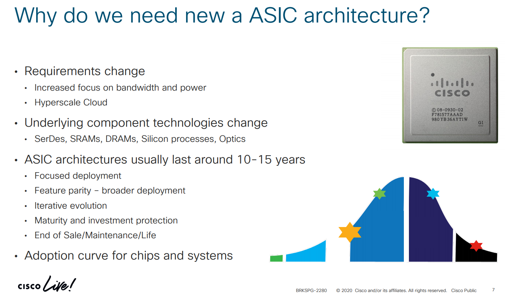
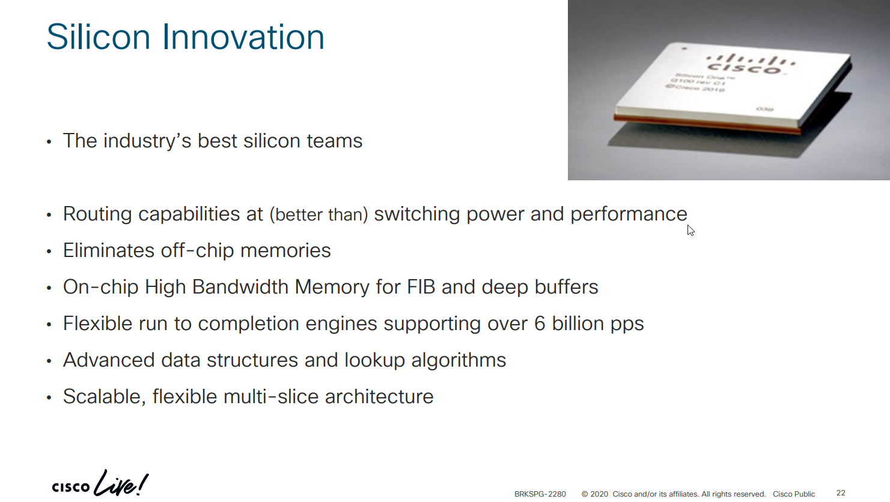
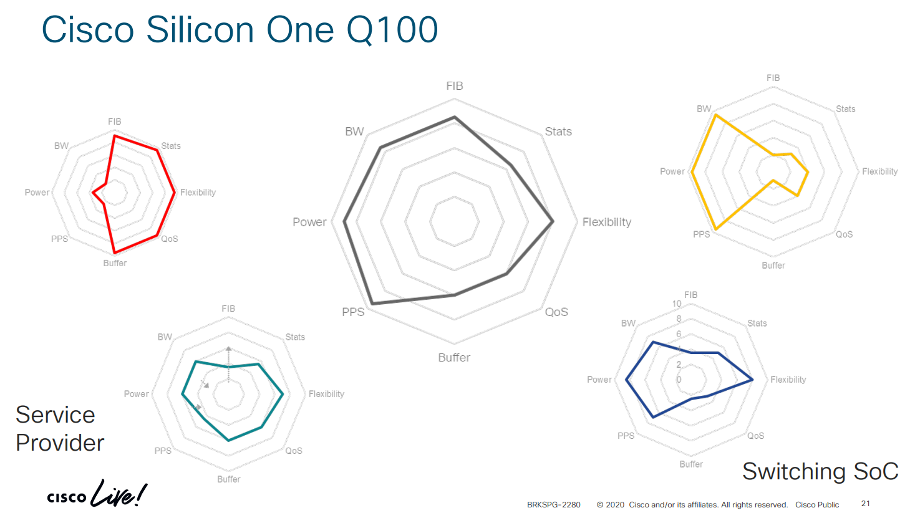
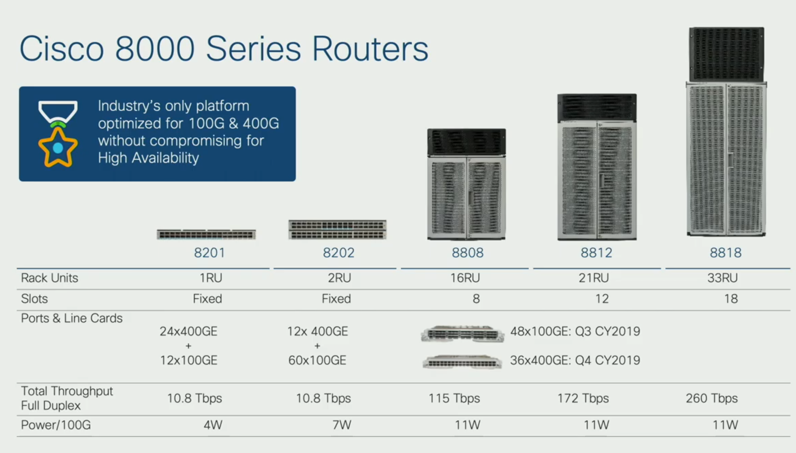
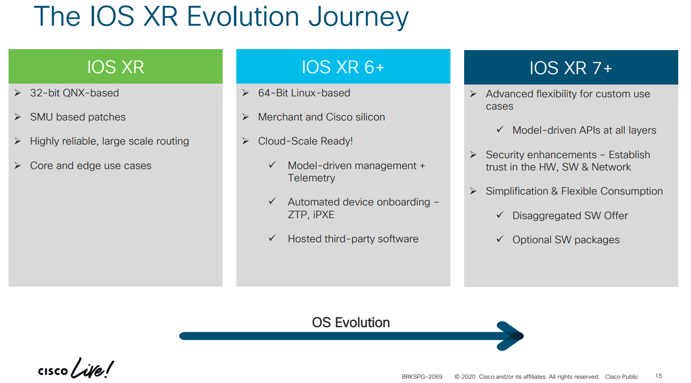
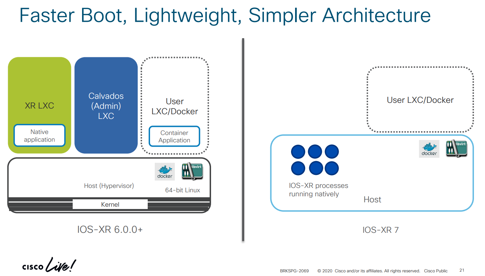
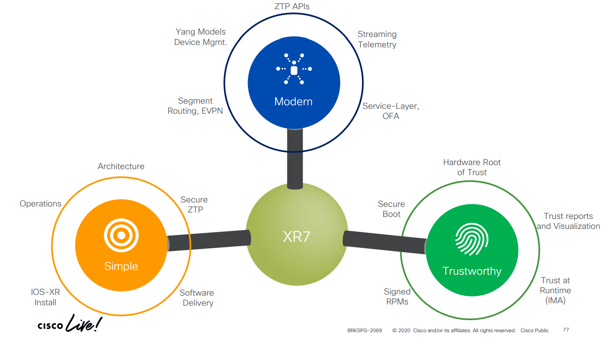

Last year Cisco [announced](https://newsroom.cisco.com/press-release-content?type=webcontent&articleId=2039386) their intent to move away from purchasing merchant silicon and start building their own chips. Quite a surprise for many, as the SDN traits are to decouple software from hardware, relying heavily on software, and using commodity hardware. This begs the question: in which area/vertical would this be implemented first? Well, all points to Service provider! :D

# The Brain

Which are the reasons behind this movement?

One of the main concerns is the massive amount of power that high end devices require to run. And as a consequence, how to provide high data throughput while keeping the energy consumption lower. In addition to that, the lack of feature parity between new and old systems/devices. Whenever a new device is released, it would run **some** of the feature its predecessor did, but it would take time before getting to a feature parity between both generations.

How does it look when compared with other chips in the market? (spoiler alert - Cisco Live slides!). Cisco Silicon One sits in the middle (gray).

# The body

Where would this almighty chip be installed? In their new [Cisco 8000 series](https://youtu.be/KIGct1QOtdI)!

Sounds hard to believe that a device would be able to provide 100G of throughput while consuming less energy than your coffee maker.

These devices are able to provide 100G and 400G throughput in their line cards. MACSEC can run at line rate! (only the 100G line card for now).

Now comes the final piece of the puzzle: which OS would be those high-end and not-to-power-hungry routers running? The new and shinny IOS XR7!

# The soul

Over time we have seen how IOS XR has evolved, slowly moving towards a complete Linux-based and accessible solution, rather than a set of processes running on top of the OS. [IOS XR7](https://youtu.be/B6sabNQkh5k) moves towards the [network disaggregation](https://packetpushers.net/simplified-approach-sdn-network-disaggregation/) paradigm. They are becoming more open devices (supporting data models) and focused on features, rather than platform specific matters.

A comparison between IOS XR6 and IOS XR7 from the architectural PoV is quite pleasant to see. It feels and looks less complicated: no more nested mumbo-jumbo and separated modules on top of a hypervisor.

Each of the features would be enabled and upgrade-able in a per-module basis, using packet managers like rpm or apt, and minimizing downtime while increasing flexibility. Cisco would work as your public repository (assuming your company would agree with these policies), or you could also set a private repository in your intranet, and BAM! Upgrade your routers in the same way you upgrade your Linux distro. Isn't that fantastic?

It does not end there: IOS XR7 would include security features to prevent all those packages from being tampered by anybody and in any way. They would be signed and verified, and over each reload, secure boot would run to guarantee OS integrity. A system cannot be called incorruptible or completely secure (no system can), but it can be trustworthy and reliable.

Cisco is embracing DevOps with this OS: software delivery, CI/CD pipelines, support for configuration management tools and collaborative workflows. You have all the power you can get in Linux, but watch out: with great power comes greater responsibility! :D

# Closing thoughts

The fusing of these pillars to deliver a high-end, low-consumption series of routers with a flexible and open soul (OS) is mind-boggling. The possibilities in the future seem immense! Are you ready to learn Linux? I am entirely sure that this will follow with other flavors of Cisco IOS, get yourself ready, because Linux is here to stay! :D
