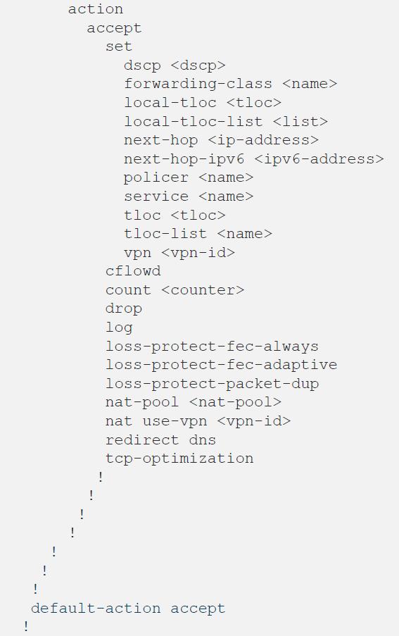

Data policies are one powerful tool for Cisco SD-WAN to deliver its promises. They allow specific traffic flows to be redirected or steered in a particular way within or throughout the SD-WAN overlay network. More specifically, Data Policies allow the solution to do:

- Any modification affecting data plane forwarding
    - E.g. Packet marking, specific transport forwarding, Application Aware Routing (AAR), NAT, traffic redirection

## Provisioning:

Policies can be provisioned in two ways:

- Centralized
    - Pushed from vManage to vSmart through a NETCONF transaction and then advertised to Edge devices by vSmart via OMP - affects all edges matched by a list
- Localized
    - Pushed from vManage directly to Edge devices through a NETCONF transaction - affects specific devices requiring tailored policies or settings (requires a feature template to reference it)

## Which are the differences?

- Centralized Data policy - can only be one enabled per VPN per site ID
    - E.g. Packet marking, specific transport forwarding, Application Aware Routing (AAR), NAT, traffic redirection
    - Configuration does not stay in the Edge, it gets delivered through OMP and stored in the volatile RIB, hence, temporary - not persistent after reboot
- Localized Data Policy
    - E.g. QoS, ACLs
    - Configuration stays in the Edge, it gets delivered through NETCONF, akin to typing commands in the device's CLI - persistent after reboot

## Data Policy Structure (in CLI format)

- 
    

- 
    

Text version:

```
data-policy <name>
 vpn-list <name>
  sequence <n>
   match
    app-list <name>
    destination-data-ipv6-prefix-list <name>
    destination-data-prefix—list <name>
    destination-ip <ip-address>
    destination-ipv6 <ipv6-address>
    destination-port <port>
    dnsrequest | response
    dnsapp-list <name>
    dscp <dscp>
    packet-length <length>
    plp <plp>
    protocol <protocol>
    source-data-ipv6-prefix-list <name>
    source-data-ip-prefix-list <name>
    source-ip <ip-address>
    source-ipv6 <ipv6-address>
    source-port <port>
    tcp-syn
   !
  !
  !
  action
    accept
     set
      dscp <dscp>
      forwarding-class <name>
      local-tloc <tloc>
      local-tloc-list <list>
      next-hop <ip-address>
      next-hop-ipv6 <ipv6-address>
      policer <name>
      service <name>
      tloc <tloc>
      tloc-list <name>
      vpn <vpn-id>
     cflowd
     count <counter>
     drop
     log
     loss-protect-fec-always
     loss-protect-fec-adaptive
     loss-protect-packet-dup
     nat-pool <nat-pool>
     natuse-vpn <vpn-id>
     redirect dns
     tcp-optimization
    !
   !
  !
 !
!
default-action accept | drop
```

Analogous to route-maps in Cisco IOS, the data policy contains a set of elements that can be matched, and a set of actions which can be performed upon matching them.

**NOTE:** Be mindful of the default action at the bottom of the data policy.

## Policy Application:

Data Policies can be applied in three modes (note the direction is from the Edge's point of view):

- From-Service (Upstream - towards WAN from the LAN)
- From-Tunnel (Downstream - towards LAN from the WAN)
- All (Both Up- and Downstream)


Different policies can be used if applied in different direction. The most common to direction to apply a policy is Upstream.

## Types of data policy

Among the Data Policies there are 3 main types of policies that can be configured to handle traffic flows:

- Application Aware Routing (AAR)
- Traffic Data
- Cflowd

### Application Aware Routing (AAR)

- In short: PBR on steroids
    - Allows matching of many values within the IP packets, among those:
        - Source and destination IP addresses
        - Source and destination ports
        - Layer 4 transport protocol
        - IP DSCP packet markings
        - Applications - using the DPI engine
            - Qosmos DPI engine for vEdge appliances (Viptela OS)
            - NBAR2 for Cisco appliances (SD-WAN based IOS XE image)
- After getting matched, packets can be forwarded according to certain criteria:
    - Specific transport
        - E.g. If the Internet link is down, nobody browses Youtube or Facebook
    - Meeting specific SLA (according to drop, delay and jitter thresholds)
        - E.g. If the MPLS link from one provider shows high delay, forward traffic through another provider’s MPLS link

**Note: AAR governs how traffic is forwarded between SD-WAN nodes within and throughout the overlay. In other words: between Edge routers only. Matching takes place in a top-down manner, akin to well-known Cisco Access Lists and Route Maps.**

#### How are those thresholds calculated?

The AAR policy relies on the BFD probes sent through the IPsec tunnels between Edge appliances. The results of the probes are stored in buckets, and each bucket has a specific duration/length. A mean average calculation of all the buckets is the result observed by the solution when reporting link quality. The group of thresholds to be met (and to which the quality of the links are compared) is called SLA.

- 
    

The average nature of the calculation of the values drives a certain tolerance factor, reducing the responsiveness in expense of stability. In other words: for the solution to detect a brownout condition in a link given default values, it would require at least one bucket to be filled (10 minutes) so a change can be triggered. 

- 
    

 These default values can be customized in order to accommodate more aggressive/sensitive SLA requirements:

- 
    

#### Example AAR Policy:

```
policy
 app-route-policy STANDARD-APP-POLICY
  vpn-list VPN-1
   sequence 1
    match
     dscp 46 !>>>> Matching DSCP values
    !
    action
     count                      SLA_PLATINUM_COUNTER
     backup-sla-preferred-color biz-internet private1 !>>>> Preferred and backup transport/color
     sla-class SLA_PLATINUM preferred-color private1 !>>>> SLA to meet
    !
   !
   sequence 11
    match
     dscp 34
    !
    action
     count                      SLA_GOLD_COUNTER
     backup-sla-preferred-color biz-internet private1 !>>>> Preferred and backup transport/color
     sla-class SLA_GOLD preferred-color private1 !>>>> SLA to meet
    !
   !
   sequence 21
    match
     dscp 24
    !
    action
     count                      SLA_GOLD_COUNTER
     backup-sla-preferred-color biz-internet private1 !>>>> Preferred and backup transport/color
     sla-class SLA_GOLD preferred-color private1 !>>>> SLA to meet
    !
   !
   sequence 31
    match
     app-list AL_FILE_TRANSFER !>>>> Matching Application list/family
    !
    action
     count                      SLA_BRONZE_COUNTER
     backup-sla-preferred-color biz-internet private1 !>>>> Preferred and backup transport/color
     sla-class SLA_BRONZE preferred-color biz-internet !>>>> SLA to meet
    !
   !
  !
!
policy
 sla-class SLA_BRONZE !>>>> SLA to meet
  loss    25
  latency 500
 !
 sla-class SLA_GOLD !>>>> SLA to meet
  loss    2
  latency 110
 !
 sla-class SLA_PLATINUM !>>>> SLA to meet
  loss    1
  latency 100
 !
!
!Magnitudes and units for the SLA values/thresholds
  jitter    Jitter, in milliseconds
  latency   Latency, in milliseconds
  loss      Loss percentage
```

###   
Traffic Data

Traffic Data is the most flexible policy among all data policies. It allows the operator to define specific elements and implement forwarding based on several criteria. Analogous to the well known route-maps and access lists in Cisco IOS, among the elements to be created and/or referenced the following ones can be found:

- Next Hops
- TLOC
- TLOC lists
- Data prefixes
- Data prefix lists
- Services
    - References a point in the fabric with a specific service to be offered - it can be created and advertised into the overlay swiftly without disturbing or modifying already existing infrastructure
    - Traffic will be steered/redirected to a particular service in the overlay network only if a data policy dictates it
- Interfaces
- Policers
- Forwarding Classes
- DSCP markings
- Application Family lists
- Port numbers

As the variety of elements might hint, the possible combinations and degree of customization are rich, which provides a highly flexible tool to meet complex requirements. Data Traffic policies allow to steer, redirect, overwrite/override and reroute traffic inbound and outbound the overlay. As opposed to the AAR policy which takes place between TLOCs belonging to Edges only, **Data Traffic policy can reference elements within and outside of the SD-WAN overlay network**. Providing the capability to manipulate, aggregate and de-aggregate traffic flows based on a variety of information included in every forwarded packet.

**A word of caution:** care should be taken when attempting to deploy complex policies. Solutions tend to be as complex or more than the problems they are meant to fix. A high degree of flexibility could also lead to an even higher degree of complexity.

The logic behind the data policies is analogous to Cisco's prefix/access lists and route-maps. In other words: sequences are evaluated in a drop-down manner and halted as soon as a match is found. In addition to that, the default action at the end of a policy is "drop", analogous to an access list in the Cisco lingo.

Some examples of use cases are shown below:

#### DIA Using Data Policy:

- More granular than a route in the service VPN
    - Match prefixes, ports and others
- Here only breaking out web traffic
    - It could match O365 and other similar cloud apps
- A specific transport can be set to be used as exit point

```
data-policy DIA
  vpn-list VPN-10
    sequence 1
     match
      destination-data-prefix-list INTERNAL-NETWORKS !>>>> This prefix list had to be created beforehand (Groups of Interest section)
     !
     action accept
     !
    !
    sequence 11
     match
      destination-port 80 443
      source-ip 0.0.0.0/0
     !
     action accept
      nat use-vpn 0 !>>>> steer traffic towards VPN 0's underlay infra
```

#### DIA With Service Chaining

- Redirect traffic to locally configured service
    - Here a GRE tunnel
    - Leverage external elements like Umbrella SIG or zScaler cloud gateway
- GRE or IPSec tunnel configured on local device

```
policy
 data-policy Web_Firewall
  vpn-list vpn_all
   sequence 10
    match protocol 6
    match destination-port 80 443
    !
    action accept
     set
      service FW local !>>>> A service can be created to reference a point in the overlay or in the local Edge
     !
    !
   !
   default-action accept
```

### Cflowd

Cflowd allows the administrator to monitor traffic flowing through vEdge routers in the overlay network and export flow information to a configured collector. Cflowd sends periodic information about the flow to its collector. The exported information contains data identifying the flows, which is contained in the IP packets. Viptela OS implements Cflowd version 10, also knows as the IP Flow Information Export (IPFIX) protocol.

Cflowd policies are straightforward to configure, the required elements for a Cflowd policy to operate are the following:

- Active Flow Timeout
- Inactive Flow Timeout
- Flow Refresh
- Sampling Interval
- VPN ID
- IP address
- Port
- Protocol
- Source Interface

An example of a couple of Cflowd policies is shown below:

```
policy
 cflowd-template CFT_CFLOWD_ALL_HUBS
  flow-active-timeout    60
  flow-sampling-interval 32
  collector vpn 512 address 10.15.1.20 port 2055 transport transport_udp source-interface mgmt0
  collector vpn 512 address 10.15.128.20 port 2055 transport transport_udp source-interface mgmt0
  collector vpn 512 address 192.0.2.10 port 9995 transport transport_udp source-interface mgmt0
  collector vpn 512 address 192.0.2.254 port 9995 transport transport_udp source-interface mgmt0
 !
 !
 !
 cflowd-template CFT_CFLOWD_BRANCHES
  flow-active-timeout    60
  flow-sampling-interval 32
  collector vpn 1 address 10.15.1.20 port 2055 transport transport_udp source-interface loopback1
  collector vpn 1 address 192.0.2.10 port 9995 transport transport_udp source-interface loopback1
  collector vpn 1 address 192.0.2.254 port 9995 transport transport_udp source-interface loopback1
 !
```

Note above there are two Cflowd policies shown. Each policy can be applied to a set of devices (site list) and their settings customized. Some sites could source samples from different VPNs and interfaces, and towards different destination servers. As long as the site list is correctly crafted (and there are no duplicates between site lists) their corresponding policies can be customized.

**Note:** A maximum number of 4 collectors are supported per policy.

### Step-by-step guide (vManage GUI) - Creation of a Centralized Data Policy

Given the modular nature of the solution, some elements (lists) have to be created beforehand so they are referenced by the policy itself later on.

The minimal elements required are:

- Site list (matching several sites, or simply a single one) - it will depend on your requirements
- VPN list (matching several VPNS, or simply a single VPN) - in general, one VPN list per Data Policy is the thumb rule, as each VPN is an isolated virtual realm

Optional elements (depending on your policy)

- Source Data Prefix List
- Destination Data Prefix List
- Application Family list
- TLOC list
- Policer list
- NATpool interfaces (Edge configuration)

### Walkthrough:

From the vManage Dashboard:

- Approach the left pane in the configuration section and select "Policies"

- 
    

- Create a new policy or edit an already existing one - note that centralized policies contain control and data policies for every VPN and site. This document focuses on data policies.

- 
    

- When creating a policy from scratch, the wizard will guide the user through the workflow:

- 
    

- Note in **green** the workflow steps
- Note in **red** the groups of interest (lists)

Once the groups of interest have been created the workflow can advance to its next step (Configure Topology and VPN Membership). If lists were created prior to the policy itself, no action is required in this step, it can be skipped.

- 
    

- By default, in absence of any VPN topology policy created, Edge devices till attempt to establish data plane tunnels (IPsec) from every transport towards any transport. In other words: **full mesh.**
    - There is no need to create a topology policy, it can be left blank, which assumed full mesh
- The VPN membership dictates which devices belong to a particular VPN, preventing them from joining to other segments of the network (VPNs) they haven't been authorized to.

Once the topology and VPN membership step has been covered, the data policies can be created and applied. 

- 
    

Among the Data Policies there are 3 main types of policies that can be configured to handle traffic flows:

- Application Aware Routing
- Traffic Data
- Cflowd

Each policy has its use cases and requirements to be met, refer to the information above to select the policy that best meets your requirements. The policies shown above were displayed in their equivalent CLI expression. When creating policies in vManage, their creation entails the use of a Graphical User Interface (GUI).

#### Application Aware Routing

When creating an AAR policy, the default screen shown looks as follows:

- 
    

By selecting the "+ Sequence Type" two options are shown in the right. Let us continue in this exam with "Sequence Rule":

- 
    

AAR policies would allow the matching of several elements, no only "applications" as their name might imply. Once the criteria to match has been selected, the actions to take place will be next:

- 
    

An example of possible combinations can be found below.

- 
    

Once the matching criteria and actions have been selected, save the policy at the bottom of the screen.

#### Traffic Data

To create a Traffic Data policy, approach the "Add Policy" button in the GUI, under the "Traffic Data" option. A policy can be created prior to this step and be imported as well.

- 
    

When creating a policy, several options are offered with regards to sequence to be added, choose the one best matching your use case.

- 
    

The most flexible - and also more complex - among the options offered are "Custom" policies. Below is shown a capture of possible combinations for matching criteria using a Custom policy:

- 
    

Possible actions (also varied) are shown below as well:

- 
    

Note the capability to rewrite DSCP values and forwarding classes (QoS queues), redirect traffic to a specific next hop (outside of the overlay), TLOC or set of TLOCs (both inside the overlay), use a NAT pool, or apply a policer.

**NOTE: Always remember the "default-action" clause of a Data Policy. It is by default "drop". Data not matching the criteria (could be for NAT or redirection/steering) does not necessarily have to be dropped, it could simply skip the process. Not changing this setting would cause an outage (I've been there already) for non-matching traffic. Remember to change that value to "accept" as shown below:**

- 
    

Once the matching criteria and actions have been selected, save the policy at the bottom of the screen.

#### Cflowd

To create a Cflowd policy, approach the "Add Policy" button under the "Cflowd" option in the GUI.


The required information for the policy to be created using vManage is shown below.

- 
    

Once the collector and sample settings have been introduced, save the policy at the bottom of the screen.

#### Policy application

The last of the steps in the policy creating workflow is to apply for policies to a specific list and define their direction (when required). Being the list to get the policy applied a group of sites or VPNs.

- 
    

Let us attempt to apply a test Data Policy in a group of sites to observe the required information to input in order to perform this operation:

- 
    

Note the directions available for the Data Policy: From Service, From Tunnel, All. In addition to that, a site list and a VPN list.

- 
    

Once the desired direction, site and VPN lists have been selected, proceed to Save the Policy and push it to the vSmart controllers. The policy should be pushed within seconds, and sites matching the specific lists will get their new settings from vSmart via OMP.

Hope this post is useful to you!

David

Resources: [https://recurseit.com/2020/02/26/resources-for-the-cisco-sd-wan-exam/](https://recurseit.com/2020/02/26/resources-for-the-cisco-sd-wan-exam/)
