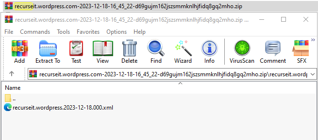

In the [previous blog](https://recurseit.com/post/2025/03/migrating-from-wordpress-to-hugo---part-2/) we spoke the first two steps of the migration process. In this blog we will continue with the following step (in bold). Let us bring those steps back in the section below:

## The process I went through can be (roughly) outlined as follows:

1. Export your Wordpress Site
2. [Migrate your domain to CloudFlare](https://wordpress.com/support/domains/transfer-domain-registration/) (Potato.com) - (optional)
3. **Convert the exported site to Markdown (I found a wonderful tool written by [Bill Boyd](https://www.linkedin.com/in/willboyd/))**
4. Install HUGO and run your website locally (I did run it in my RaspBerry Pi for a while)
5. Create a repository in Github
6. Push your local website structure into the repository (VSCode simplifies things)
7. Create a CloudFlare account
8. Create a developer documentation page through a Worker
9. Link the developer page to your GitHub repository
10. Define environmental variables and deploy
11. Create DNS records to redirect your documentation website to your original domain (xyz.pages.dev -> xyz.com) - (optional)
12. Keep on upskilling

Following the previous blogs, we wil continue where we left off: **We will cover step 3 in this post, and the rest will be covered in the following ones.**

### 3. Convert the exported site to Markdown

If you [followed the steps described by WordPress](https://wordpress.com/support/export/), you should have downloaded a compressed file with an .xml file inside. In my case, I obtained the following one (the amount of files may vary depending on your number of blogs and images):



Additionally, you will need the [WordPress export to Markdown tool](https://github.com/lonekorean/wordpress-export-to-markdown).

**NOTE**: This tool requires nodejs to work. The minimal version for nodejs is "20.5.0". In my case, as I have a RaspBerryPi and it runs RaspBerry Pi OS, a linux debian-based distro (Debian 12 (bookworm)). I did install nodejs through nvm (node version manager) to get v22. The steps I followed are below:

1. Navigate to nvm's [repo](https://github.com/nvm-sh/nvm#installing-and-updating) and follow the instructions to install it:
```
dpenaloza@rpi-prague:~ $ curl -o- https://raw.githubusercontent.com/nvm-sh/nvm/v0.40.3/install.sh | bash
  % Total    % Received % Xferd  Average Speed   Time    Time     Time  Current
                                 Dload  Upload   Total   Spent    Left  Speed
100 16631  100 16631    0     0  53770      0 --:--:-- --:--:-- --:--:-- 53996
=> nvm is already installed in /home/dpenaloza/.nvm, trying to update using git
=> => Compressing and cleaning up git repository

=> nvm source string already in /home/dpenaloza/.bashrc
=> bash_completion source string already in /home/dpenaloza/.bashrc
=> Close and reopen your terminal to start using nvm or run the following to use it now:

export NVM_DIR="$HOME/.nvm"
[ -s "$NVM_DIR/nvm.sh" ] && \. "$NVM_DIR/nvm.sh"  # This loads nvm
[ -s "$NVM_DIR/bash_completion" ] && \. "$NVM_DIR/bash_completion"  # This loads nvm bash_completion
```
Once you reset your terminal (or apply the commands above), make sure you install the nodejs and chalk (required for this tool as well) packages:
```
dpenaloza@rpi-prague:~ $ nvm install 22
Downloading and installing node v22.15.1...
Downloading https://nodejs.org/dist/v22.15.1/node-v22.15.1-linux-armv7l.tar.xz...
########################################################################################################################################### 100.0%
Computing checksum with sha256sum
Checksums matched!

Now using node v22.15.1 (npm v10.9.2)
Creating default alias: default -> 22 (-> v22.15.1)
dpenaloza@rpi-prague:~ $ npm install chalk

added 67 packages, and audited 68 packages in 10s

12 packages are looking for funding
  run `npm fund` for details

found 0 vulnerabilities
dpenaloza@rpi-prague:~ $ node -v
v22.15.1
dpenaloza@rpi-prague:~ nvm current
v22.15.1
dpenaloza@rpi-prague:~ $ npm -v
10.9.2
```
2. Create a folder to place your exported WordPress file and to clone the tool you are about to use. Mine looks like this:
```
dpenaloza@rpi-prague:~/WP2Hugo $ tree
.
├── exported
│   └── recurseit.wordpress.2023-12-18.000.xml
├── markdown
└── wordpress-export-to-markdown
```
Note the "markdown" folder: I have created it to be used as the output destination of the conversion.
3. Once you have the required (or higher) nodejs version, clone the [WordPress export to Markdown tool](https://github.com/lonekorean/wordpress-export-to-markdown):
```
dpenaloza@rpi-prague:~/WP2Hugo $ git clone https://github.com/lonekorean/wordpress-export-to-markdown.git
Cloning into 'wordpress-export-to-markdown'...
remote: Enumerating objects: 1356, done.
remote: Counting objects: 100% (631/631), done.
remote: Compressing objects: 100% (180/180), done.
remote: Total 1356 (delta 501), reused 459 (delta 451), pack-reused 725 (from 3)
Receiving objects: 100% (1356/1356), 401.29 KiB | 1.97 MiB/s, done.
Resolving deltas: 100% (910/910), done.
```
4. Once you have finished cloning it, your folders should look like this:
```
dpenaloza@rpi-prague:~/WP2Hugo $ tree
.
├── exported
│   └── recurseit.wordpress.2023-12-18.000.xml
├── markdown
└── wordpress-export-to-markdown
    ├── app.js
    ├── LICENSE.md
    ├── package.json
    ├── package-lock.json
    ├── README.md
    └── src
        ├── data.js
        ├── frontmatter.js
        ├── intake.js
        ├── normalizers.js
        ├── parser.js
        ├── questions.js
        ├── shared.js
        ├── translator.js
        └── writer.js

5 directories, 15 files
```
5. At this point we are finally ready to run the tool and convert the exported file (.xml) into markdown. Let us finally pop the cherry! Head to the folder where the tool has been cloned into, and run the command below and follow the wizard:
```
dpenaloza@rpi-prague:~/WP2Hugo/wordpress-export-to-markdown $ npx wordpress-export-to-markdown --wizard=true --input=/home/dpenaloza/WP2Hugo/exported/recurseit.wordpress.2023-12-18.000.xml --output=/home/dpenaloza/WP2Hugo/markdown/

Starting wizard...
✓ Put each post into its own folder? Yes
✓ Add date prefix to posts? Yes
✓ Organize posts into date folders? Year and month folders
✓ Save images? All Images

Parsing...
17 normal posts found.
4 pages found.
22 custom "feedback" posts found.
115 attached images found.
87 images scraped from post body content.

Saving posts...
43 posts to save.
✓ [post] first-blog-post
✓ [page] about
✓ [page] contact
<Omitted for brevity>
Done, got them all!

Saving images...
122 images to save.
✓ [image] gre-2-routers.png 
✓ [image] r1-rib.png 
✓ [image] r2-rib.png 
✓ [image] packet-capture-r2-to-r1-ping.png 
✓ [image] gre-p2p-3-routers.png 
<Omitted for brevity>
Done, got them all!

All done!
Look for your output files in: /home/dpenaloza/WP2Hugo/markdown
dpenaloza@rpi-prague:~/WP2Hugo/wordpress-export-to-markdown $ 
```
6. Once the process has finished, look for the output folder:
```
dpenaloza@rpi-prague:~/WP2Hugo/markdown $ pwd
/home/dpenaloza/WP2Hugo/markdown
dpenaloza@rpi-prague:~/WP2Hugo/markdown $ ls -la
total 20
drwxr-xr-x 5 dpenaloza dpenaloza 4096 May 18 14:42 .
drwxr-xr-x 5 dpenaloza dpenaloza 4096 May 18 14:14 ..
drwxr-xr-x 3 dpenaloza dpenaloza 4096 May 18 14:42 custom
drwxr-xr-x 4 dpenaloza dpenaloza 4096 May 18 14:42 pages
drwxr-xr-x 6 dpenaloza dpenaloza 4096 May 18 14:42 posts
```
And _Voilà_! You have converted your WordPress file into markdown!

#### After following the steps above you should have a markdown skeleton to start. What follows is to understand HUGO, its idiosyncrasies and folder structure/hierarchy.

We will continue exploring HUGO in the next blog posts.

Thank you for reading!

# References and further reading:
- [NodeJS](https://nodejs.org/en)
- [NVM](https://github.com/nvm-sh/nvm)
- [RaspBerry Pi OS](https://www.raspberrypi.com/software/)
