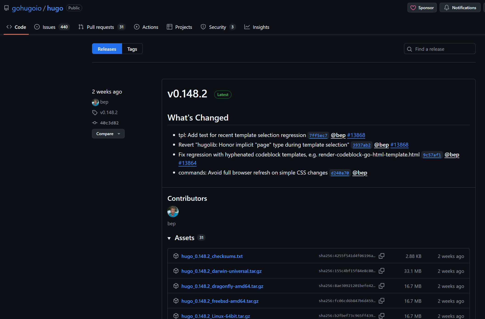

In the [previous blog](https://recurseit.com/post/2025/migrating-from-wordpress-to-hugo---part-3/) we spoke about the third step of the migration process. In this blog we will continue with the following step (in bold). Let us bring those steps back in the section below:

## The process I went through can be (roughly) outlined as follows:
1. Export your Wordpress Site
2. [Migrate your domain to CloudFlare](https://wordpress.com/support/domains/transfer-domain-registration/) (Potato.com) - (optional)
3. Convert the exported site to Markdown (I found a wonderful tool written by [Bill Boyd](https://www.linkedin.com/in/willboyd/))
4. **Install HUGO and run your website locally (I did run it in my RaspBerry Pi for a while)**
5. Create a repository in Github
6. Push your local website structure into the repository (VSCode simplifies things)
7. Create a CloudFlare account
8. Create a developer documentation page through a Worker
9. Link the developer page to your GitHub repository
10. Define environmental variables and deploy
11. Create DNS records to redirect your documentation website to your original domain (xyz.pages.dev -> xyz.com) - (optional)
12. Keep on upskilling

#### **Regardless of you having a website in WordPress before this step or not, here is where both flows converge.**
Following the previous blogs, we wil continue where we left off: **We will cover step 4 in this post, and the rest will be covered in the following ones.**

If you followed the steps described in the [previous blog](https://recurseit.com/post/2025/migrating-from-wordpress-to-hugo---part-3/), you should have a folder structure like this (I have added some options to limit the output for readability):

```
dpenaloza@rpi-prague:~/WP2Hugo/markdown $ tree -dL 2
.
├── custom
│   └── feedback
├── pages
│   ├── 2016
│   └── _drafts
└── posts
    ├── 2016
    ├── 2018
    ├── 2020
    └── 2021
```
Pay attention to the folder structure, it is of utmost importance, as HUGO relies on a hierarchical set of files and folders to function correctly. In other words: structure and organization are key.

Preventing myself from being another a victim of the [law of diminishing returns](https://en.wikipedia.org/wiki/Diminishing_returns), I will refer you to [HUGO's official documentation explaining the directory structure](https://gohugo.io/getting-started/directory-structure/).

As you may have noticed, the directory structure above is missing a series of files and folders which are configuration-related, and not content-related (which should already be there, under the "posts" folder).

What should we do? **We will install HUGO and create a site from scratch to create the missing folders and settings and then move the content there.**

### 4. Install HUGO and run your website locally (I did run it in my RaspBerry Pi for a while)

[Installing](https://gohugo.io/installation/linux/) HUGO could be as simple as running the following command (assuming you are running RaspBerry Pi OS):
```
sudo apt install hugo
```
However, the latest version is not always updated in the repositories maintained for every Linux release, they often lag behind.
An example of this is that according to [HUGO's official GitHub repository](https://github.com/gohugoio/hugo/releases) the latest release —at the time of this writing— is v0.148.2, however, debian (stable) [repos](https://packages.debian.org/search?keywords=hugo) show an older version available from the CLI:
```
dpenaloza@rpi-prague:~ $ sudo apt-cache show hugo | grep Version
Version: 0.111.3-1
---
dpenaloza@rpi-prague:~ $ apt-cache madison hugo
  hugo |  0.111.3-1 | http://raspbian.raspberrypi.com/raspbian bookworm/main armhf Packages
```
In cases like this one, please refer to the developer's latest/more stable release (unless a specific one is required).

Go ahead and browse [HUGO's official GitHub repository](https://github.com/gohugoio/hugo/releases), download the release file and install it manually using your Linux distributions' package manager:


You could do either of the following:
- Download the file directly and place it into a subfolder in the HUGO directory
- Download it via CLI (copy the file's link from the repo first) directly into the folder

Why so many files? Each file corresponds with a specific [package manager](https://www.linode.com/docs/guides/linux-package-management-overview/) and processor architecture.
How to know which one is the best for you? The command below will display your current processor architecture:
```
dpenaloza@rpi-prague:~/WP2Hugo/hugo-release $ uname -m
armv7l
```
In my case, the ARM architecture is a bit tricky and the recommendation is to compile it yourself from scratch (not usual and wont happen to you if you are running it in a VM)

Ideally, your process should be akin the following (I did this in an Ubuntu 22.04 LTS VM deployed using VMware Workstation):

#### Installing HUGO, Git and Go
```
test@test:~$ sudo apt-get install hugo
Reading package lists... Done
Building dependency tree... Done
Reading state information... Done
The following additional packages will be installed:
  git git-man liberror-perl libsass1
<...>
test@test:~$ hugo version
hugo v0.92.2+extended linux/amd64 BuildDate=2023-01-31T11:11:57Z VendorInfo=ubuntu:0.92.2-1ubuntu0.1
```
##### The version in the repository was v0.92, so we will manually install the latest one (v.148.2). We can do it by copying the link of the file matching the VM's distro and architecture: "hugo_extended_0.148.2_linux-arm64.deb" and downloading it using the "wget" command:

##### Creating folder for the installation file, moving towards it and installing it via package manager:
```
test@test:~$ mkdir hugo-release&&cd hugo-release/
test@test:~/hugo-release$ wget https://github.com/gohugoio/hugo/releases/download/v0.148.2/hugo_extended_0.148.2_linux-amd64.deb
<...>
test@test:~/hugo-release$ sudo dpkg -i hugo_extended_0.148.2_linux-amd64.deb 
```
##### Lastly, installing Go through snap
```
test@test:~/hugo-release$ sudo snap install go --classic
go 1.24.5 from Canonical✓ installed
```
#### Checking installed versions of Hugo, Git and go:
```
test@test:~/hugo-release$ hugo version
hugo v0.148.2-40c3d8233d4b123eff74725e5766fc6272f0a84d+extended linux/amd64 BuildDate=2025-07-27T12:43:24Z VendorInfo=gohugoio

test@test:~/hugo-release$ go version
go version go1.24.5 linux/amd64

test@test:~/hugo-release$ git version
git version 2.34.1
```
#### Now that we have installed what we needed, we can create a skeleton of a website
```
test@test:~/hugo-release$ hugo new site my-site
Congratulations! Your new Hugo site was created in /home/test/hugo-release/my-site.
```
#### Once you move to the newly created directory, the following should be the end state:
```
test@test:~$ cd /home/test/hugo-release/my-site
test@test:~/hugo-release/my-site$ ls -la
total 44
drwxrwxr-x 10 test test 4096 srp  9 21:17 .
drwxrwxr-x  3 test test 4096 srp  9 21:17 ..
drwxrwxr-x  2 test test 4096 srp  9 21:17 archetypes
drwxrwxr-x  2 test test 4096 srp  9 21:17 assets
drwxrwxr-x  2 test test 4096 srp  9 21:17 content
drwxrwxr-x  2 test test 4096 srp  9 21:17 data
-rw-rw-r--  1 test test   83 srp  9 21:17 hugo.toml
drwxrwxr-x  2 test test 4096 srp  9 21:17 i18n
drwxrwxr-x  2 test test 4096 srp  9 21:17 layouts
drwxrwxr-x  2 test test 4096 srp  9 21:17 static
drwxrwxr-x  2 test test 4096 srp  9 21:17 themes

test@test:~/hugo-release/my-site$ tree
.
├── archetypes
│   └── default.md
├── assets
├── content
├── data
├── hugo.toml
├── i18n
├── layouts
├── static
└── themes

8 directories, 2 files
```
Now that you have your skeleton of a website, the contents from your blog can be moved into the "content" folder. The following is an example of my structure:
```
test@test:~/hugo-release/my-site$ tree -L 5
.
├── archetypes
│   └── default.md
├── assets
├── content
│   └── posts
│       ├── 2016
│       │   ├── 05
│       │   │   ├── ccna-refresh
│       │   │   └── first-blog-post
│       │   ├── 06
│       │   │   ├── gre-tunnels
│       │   │   └── gre-tunnels-ii-revenge-of-keepalives
│       │   ├── 07
│       │   │   ├── acls-filtering-insights
│       │   │   └── gre-tunnels-iii-security-awakens
│       │   ├── 08
│       │   │   └── ipv4-to-ipv6-from-32-to-128-bits
│       │   └── 11
│       │       └── returning-to-the-world-of-the-living-aaaand-ccdp-achieved-d
│       ├── 2018
│       │   ├── 06
│       │   │   └── a-lot-happened-updates-are-in-order
│       │   └── 07
│       │       └── post-cisco-live-us
│       ├── 2020
│       │   ├── 01
│       │   │   └── new-year-resolution
│       │   ├── 02
│       │   │   ├── cleur-and-other-updates
│       │   │   └── resources-for-the-cisco-sd-wan-exam
│       │   └── 03
│       │       ├── ciscos-service-provider-powerful-trio
│       │       └── iot-calls-for-security
│       └── 2021
│           ├── 01
│           │   └── cisco-sd-wan-data-policies
│           └── 03
│               └── cisco-sd-wan-service-side-nat
├── data
├── hugo.toml
├── i18n
├── layouts
├── static
└── themes
```
#### After following the steps above you should have a markdown skeleton to start. What follows is to understand the directory structure/hierarchy and slowly start running it locally.

We will continue exploring HUGO and Git in the next blog posts.

Thank you for reading!

# References and further reading:
- [HUGO - official documentation](https://gohugo.io/documentation/)
- [HUGO - additional learning resources](https://gohugo.io/getting-started/external-learning-resources/)