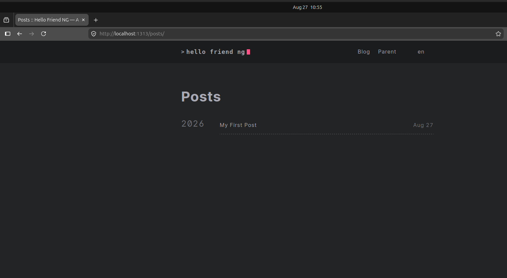
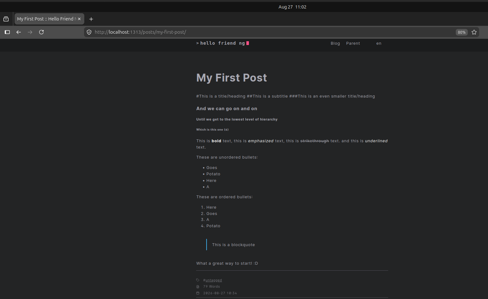

In the [previous post](https://recurseit.com/post/2026/migrating-from-wordpress-to-hugo-part-4.5/) we spoke about the fourth step of the migration process. In this post we will continue expanding on it (in bold). Let us bring those steps back in the section below:

## The process I went through can be (roughly) outlined as follows:
1. Export your Wordpress Site
2. [Migrate your domain to CloudFlare](https://wordpress.com/support/domains/transfer-domain-registration/) (Potato.com) - (optional)
3. Convert the exported site to Markdown (I found a wonderful tool written by [Bill Boyd](https://www.linkedin.com/in/willboyd/))
4. **Install HUGO and run your website locally (I did run it in my RaspBerry Pi for a while)**
5. **Create a repository in Github**
6. **Push your local website structure into the repository (VSCode simplifies things)**
7. **Create a CloudFlare account (only if you havent migrated your domain from Wordpress before)**
8. Create a developer documentation page through a Worker
9. Link the developer page to your GitHub repository
10. Define environmental variables and deploy
11. Create DNS records to redirect your documentation website to your original domain (xyz.pages.dev -> xyz.com) - (optional)
12. Keep on upskilling

### Changes and clarifications

As some time passed since the last blog post, the current OS and library versions used have changed. Below are the current release, their corresponding verifications, and install process:

- OS version: Ubuntu v26.04 LTS
- Hugo version: v0.165.0 (latest)
- Git version: v2.53.0

#### Verifying OS version
```
test@ubuntu-vm:/home$ cat /etc/os-release | grep -i version
VERSION_ID="26.04"
VERSION="26.04 LTS (Resolute Raccoon)"
VERSION_CODENAME=resolute
```

#### Verifying Git version before installing via APT
```
test@ubuntu-vm:/home$ sudo apt-cache show git | grep Version
Version: 1:2.53.0-1ubuntu1
```

##### Installing Git:
```
test@ubuntu-vm:/home$ sudo apt-get install git
<...>
The following additional packages will be installed:
  git-man liberror-perl
Suggested packages:
  git-doc git-email git-gui gitk gitweb git-cvs git-svn
The following NEW packages will be installed:
  git git-man liberror-perl
0 upgraded, 3 newly installed, 0 to remove and 18 not upgraded.
Need to get 5,453 kB of archives.
After this operation, 28.4 MB of additional disk space will be used.
<...>
```
##### Verifying Git version after installing via APT
```
test@ubuntu-vm:/home$ git version
git version 2.53.0
```
#### Verifying Hugo repository version before installing via APT
```
test@ubuntu-vm:/home$ apt-cache policy hugo
hugo:
  Installed: (none)
  Candidate: 0.154.5-1
  Version table:
     0.154.5-1 500
        500 http://es.archive.ubuntu.com/ubuntu resolute/universe amd64 Packages
```
Hugo offers several versions:
- Standard (the one available in the repository above)
  - For Core Hugo functionality	Maximum portability, minimal dependencies
- Extended
  - Core + libsass (SCSS/SASS) + libwebp (image processing)	Advanced asset pipelines, image optimization
- Extended+Deploy
  - Extended,withdeploy	Yes	Extended + hugo deploy command	Full-featured builds with cloud deployment

Credits to [deep wiki](https://deepwiki.com/gohugoio/hugo/8.2-build-variants-and-editions) as [Hugo's documentation](https://gohugo.io/installation/linux/) is a bit brief about this (the notes are minimal).

Some templates require the extended version, and for that matter, and ease of testing in the future, the recommendation is to use the extended version.

In order to use the latest extended version (v0.165.0), which is newer than the repository one -and also not-the-standard-, the .deb file must be downloaded from the [official website](https://github.com/gohugoio/hugo/releases/tag/v0.165.0).

**File name**: hugo_extended_0.165.0_linux-amd64.deb
```
test@ubuntu-vm:~/Downloads$ ls -la
total 22076
drwxr-xr-x  2 test test     4096 Aug 26 18:34 .
drwxr-x--- 16 test test     4096 Aug 26 17:37 ..
-rw-rw-r--  1 test test 22594736 Aug 26 17:44 hugo_extended_0.165.0_linux-amd64.deb
```

#### Installing Hugo extended version via dpkg (from .deb file):
```
test@ubuntu-vm:~/Downloads$ sudo dpkg -i hugo_extended_0.165.0_linux-amd64.deb 
Selecting previously unselected package hugo.
(Reading database… 185569 files and directories currently installed.)
Preparing to unpack hugo_extended_0.165.0_linux-amd64.deb…
Unpacking hugo (0.165.0)…
Setting up hugo (0.165.0)…
```
#### Verifying Hugo version after installing via dpkg (from .deb file)
```
test@ubuntu-vm:/home$ hugo version
hugo v0.165.0-76a5e1880ab46688155b02e99bab9be2a6134492+extended linux/amd64 BuildDate=2026-08-12T14:26:28Z VendorInfo=gohugoio
```
**Note**: There is no need to install Go/go-lang as the .deb file has all you need to run Hugo.

### Re-setting up the stage

At the end of the previous post the structure of the directory looked like this:
```
test@ubuntu-vm:/mnt/hugo-release/my-site$ tree -L 5
.
├── archetypes
│   └── default.md
├── assets
├── content
│   └── posts
│       ├── 2016
│       │   ├── 05
│       │   │   ├── ccna-refresh
│       │   │   └── first-blog-post
│       │   ├── 06
│       │   │   ├── gre-tunnels
│       │   │   └── gre-tunnels-ii-revenge-of-keepalives
│       │   ├── 07
│       │   │   ├── acls-filtering-insights
│       │   │   └── gre-tunnels-iii-security-awakens
│       │   ├── 08
│       │   │   └── ipv4-to-ipv6-from-32-to-128-bits
│       │   └── 11
│       │       └── returning-to-the-world-of-the-living-aaaand-ccdp-achieved-d
│       ├── 2018
│       │   ├── 06
│       │   │   └── a-lot-happened-updates-are-in-order
│       │   └── 07
│       │       └── post-cisco-live-us
│       ├── 2020
│       │   ├── 01
│       │   │   └── new-year-resolution
│       │   ├── 02
│       │   │   ├── cleur-and-other-updates
│       │   │   └── resources-for-the-cisco-sd-wan-exam
│       │   └── 03
│       │       ├── ciscos-service-provider-powerful-trio
│       │       └── iot-calls-for-security
│       └── 2021
│           ├── 01
│           │   └── cisco-sd-wan-data-policies
│           └── 03
│               └── cisco-sd-wan-service-side-nat
├── custom
├── data
├── hugo.toml
├── i18n
├── layouts
├── pages
│   ├── about
│   │   └── index.md
│   └── contact
│       └── index.md
├── static
└── themes

47 directories, 4 files
```
#### By now you should have a markdown skeleton to start. What follows is to understand the directory structure/hierarchy and slowly start running it locally.

As a reference, find here [HUGO's official documentation explaining the directory structure](https://gohugo.io/getting-started/directory-structure/).

#### Summary of the important folders:

If you were to run the following command in your computer
```
test@ubuntu-vm:/mnt/hugo-release$ hugo new project my-site2
```
The output would be:
```
Congratulations! Your new Hugo project was created in /mnt/hugo-release/my-site2.

Just a few more steps...

1. Change the current directory to /mnt/hugo-release/my-site2.
2. Create or install a theme:
   - Create a new theme with the command "hugo new theme <THEMENAME>"
   - Or, install a theme from https://themes.gohugo.io/
3. Edit hugo.toml, setting the "theme" property to the theme name.
4. Create new content with the command "hugo new content <SECTIONNAME>/<FILENAME>.<FORMAT>".
5. Start the embedded web server with the command "hugo server --buildDrafts".

See documentation at https://gohugo.io/.
```
Along with the instructions provided, this is the minimal directory structure you'd get, and whats needed to run a website in Hugo. Below is the summary of what these folders *may* contain:
```
my-site/
├── archetypes/      <-- post templates (optional)
│   └── default.md
├── assets/          <-- resources such as images, CSS, Sass, JavaScript, and TypeScript
├── content/         <-- posts
├── data/            <-- data files that augment content, configuration, localization, and navigation
├── i18n/            <-- translation tables for multilingual projects (optional)
├── layouts/         <-- templates to transform content, data, and resources (optional - your theme may have its own layouts)
├── public/          <-- automatically created when you build/run your project
├── resources/       <-- automatically created when you build/run your project
├── static/          <-- static assets like fav.ico, robots.txt and files used to verify ownership
├── themes/          <-- themes for your website (you can have many if you want)
└── hugo.toml        <-- project configuration (a file, not a folder)
```
**Note**: *Public* and *Resources* are folders that get created when building the project, they dont appear when creating the project via the command above. They were mentioned for your awareness.

**Note 2**: *Themes* contains an entire subdirectory structure, generally (and at least to start and test), you can [download a theme](https://themes.gohugo.io/) and paste it in the folder. To use a template, the project configuration file is modified (hugo.toml) to reference it, and upon bulilding, hugo will look into the *themes* folder to use the one referenced.

**Note 2 part 2**: There are much more complex implementations (like modules), but thats something beyond the scope of this post (which doesn't necessarily mean it may not come later! :D), and Hugo's documentation will certainly explain better.

### Running a simple website to test hugo

Before you run your website, you need a theme, lets copy a quick one to test it all. We will start slow and small. Baby steps!

Clone [this theme](https://themes.gohugo.io/themes/hugo-theme-hello-friend-ng/) in your *themes* folder:
```
test@ubuntu-vm:/mnt/hugo-release$ cd my-site2
test@ubuntu-vm:/mnt/hugo-release/my-site2$ git clone https://github.com/rhazdon/hugo-theme-hello-friend-ng.git themes/hello-friend-ng
Cloning into 'themes/hello-friend-ng'...
remote: Enumerating objects: 3964, done.
remote: Counting objects: 100% (72/72), done.
remote: Compressing objects: 100% (34/34), done.
remote: Total 3964 (delta 44), reused 38 (delta 38), pack-reused 3892 (from 2)
Receiving objects: 100% (3964/3964), 9.94 MiB | 5.28 MiB/s, done.
Resolving deltas: 100% (2176/2176), done.

test@ubuntu-vm:/mnt/hugo-release/my-site2$ tree -L 3
.
├── archetypes
│   └── default.md
├── assets
├── content
├── data
├── hugo.toml
├── i18n
├── layouts
├── static
└── themes
    └── hello-friend-ng
        ├── archetypes
        ├── assets
        ├── CONTRIBUTING.md
        ├── data
        ├── docs
        ├── exampleSite
        ├── i18n
        ├── images
        ├── layouts
        ├── LICENSE.md
        ├── README.md
        ├── static
        └── theme.toml

19 directories, 6 files
```
Now, copy the configuration suggested by the theme instructions (more details will come)
```
test@ubuntu-vm:/mnt/hugo-release/my-site2$ nano hugo.toml

baseurl      = "localhost"
title        = "My Blog"
language.locale = "en-us"
theme        = "hello-friend-ng"
pagination.pagerSize     = 10

[params]
  dateform        = "Jan 2, 2006"
  dateformShort   = "Jan 2"
  dateformNum     = "2006-01-02"
  dateformNumTime = "2006-01-02 15:04"

  # Subtitle for home
  homeSubtitle = "A simple and beautiful blog"

  # Set disableReadOtherPosts to true in order to hide the links to other posts.
  disableReadOtherPosts = false

  # Enable sharing buttons, if you like
  enableSharingButtons = true
  
  # Show a global language switcher in the navigation bar
  enableGlobalLanguageMenu = true

  # Metadata mostly used in document's head
  description = "My new homepage or blog"
  keywords = "homepage, blog"
  images = [""]

[taxonomies]
    category = "blog"
    tag      = "tags"
    series   = "series"

[languages]
  [languages.en]
    title = "Hello Friend NG"
    keywords = ""
    copyright = '<a href="https://creativecommons.org/licenses/by-nc/4.0/" target="_blank" rel="noopener">CC BY-NC 4.0</a>'
    readOtherPosts = "Read other posts"

  [languages.en.params]
    subtitle  = "A simple theme for Hugo"

    [languages.en.params.logo]
      logoText = "hello friend ng"
      logoHomeLink = "/"
    # or
    #
    # path = "/img/your-example-logo.svg"
    # alt = "Your example logo alt text"

  # And you can even create generic menu
  [[menu.main]]
    identifier = "blog"
    name       = "Blog"
    url        = "/posts"

  # and submenus
  [[menu.main]]
    identifier  = "parent"
    name        = "Parent"
    url         = "/parent"
    hasChildren = true

  [[menu.main]]
    identifier  = "child"
    name        = "Child"
    url         = "/parent/child"
    parent      = "parent"
```
And lastly, lets create a post to have something there:
```
test@ubuntu-vm:/mnt/hugo-release/my-site2$ hugo new content content/posts/my-first-post.md
Content "/mnt/hugo-release/my-site2/content/posts/my-first-post.md" created
```
The the file created will have the following content (date will differ):
```
test@ubuntu-vm:/mnt/hugo-release/my-site2$ cat content/posts/my-first-post.md
---
title: "My First Post"
date: 2026-08-27T10:34:32+02:00
draft: true
toc: false
images:
tags:
  - untagged
---
```
That is called [*frontmatter*](https://gohugo.io/content-management/front-matter/) and it defines the information that identifies your post. Every post must have it.
Below the "- - -" or "+++" (either works) your content will begin, the file is your canvas and markdown your format.

Lets add content to the file (below the "---"):
```
#This is a title/heading
##This is a subtitle
###This is an even smaller title/heading
#### And we can go on and on
##### Until we get to the lowest level of hierarchy
###### Which is this one (6)

This is **bold** text, this is *emphasized* text, this is ~~strikethrough~~ text. and this is _underlined_ text.

These are unordered bullets:
- Goes
- Potato
- Here
- A     

These are ordered bullets:
1. Here 
2. Goes
3. A
4. Potato

> This is a blockquote

What a great way to start! :D
```
## And finally: RUN IT!
```
test@ubuntu-vm:/mnt/hugo-release/my-site2$ hugo server -D
Watching for changes in /mnt/hugo-release/my-site2/archetypes, /mnt/hugo-release/my-site2/assets, /mnt/hugo-release/my-site2/content/posts, /mnt/hugo-release/my-site2/data, /mnt/hugo-release/my-site2/i18n, /mnt/hugo-release/my-site2/layouts, /mnt/hugo-release/my-site2/static, /mnt/hugo-release/my-site2/themes/hello-friend-ng/archetypes, /mnt/hugo-release/my-site2/themes/hello-friend-ng/assets/{js,scss}, /mnt/hugo-release/my-site2/themes/hello-friend-ng/data, ... and 3 more
Watching for config changes in /mnt/hugo-release/my-site2/hugo.toml
Start building sites … 
hugo v0.165.0-76a5e1880ab46688155b02e99bab9be2a6134492+extended linux/amd64 BuildDate=2026-08-12T14:26:28Z VendorInfo=gohugoio

WARN  deprecated: css.Sass: libsass was deprecated in Hugo v0.153.0 and will be removed in a future release. Use dartsass instead. See https://gohugo.io/functions/css/sass/#dart-sass
WARN  deprecated: .Site.LanguageCode was deprecated in Hugo v0.158.0 and will be removed in a future release. Use .Site.Language.Locale instead.

                  │ EN  
──────────────────┼─────
 Pages            │  15 
 Paginator pages  │   0 
 Non-page files   │   0 
 Static files     │ 547 
 Processed images │   0 
 Aliases          │   5 
 Cleaned          │   0 

Built in 453 ms
Environment: "development"
Serving pages from disk
Running in Fast Render Mode. For full rebuilds on change: hugo server --disableFastRender
Web Server is available at //localhost:1313/ (bind address 127.0.0.1) 
Press Ctrl+C to stop
```
**Note 3**: ignore the warnings.

Open your browser and navigate to [http://localhost:1313/posts/](http://localhost:1313/posts/) and click your first blog post:





Congratulations, you have made your first blog post with HUGO!

We will continue exploring HUGO in the next posts.

Thank you for reading!

# References and further reading:
- [HUGO - official documentation](https://gohugo.io/documentation/)
- [Markdown Guide - Hugo Markdown Support](https://www.markdownguide.org/tools/hugo/)